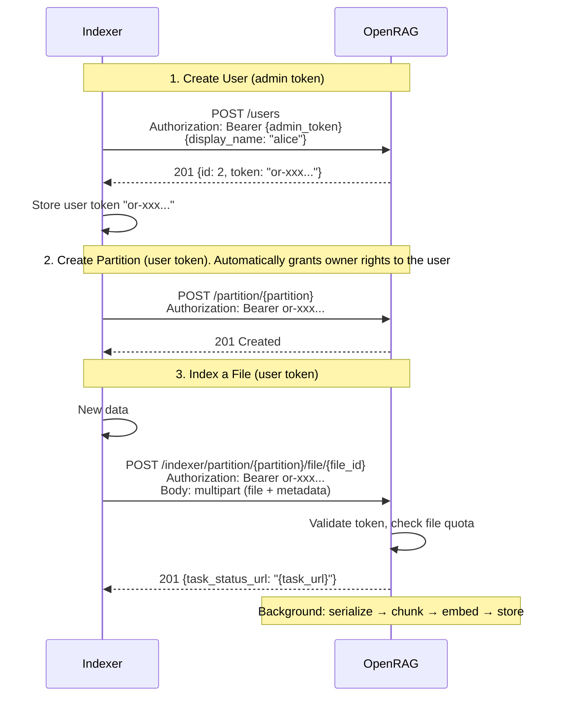
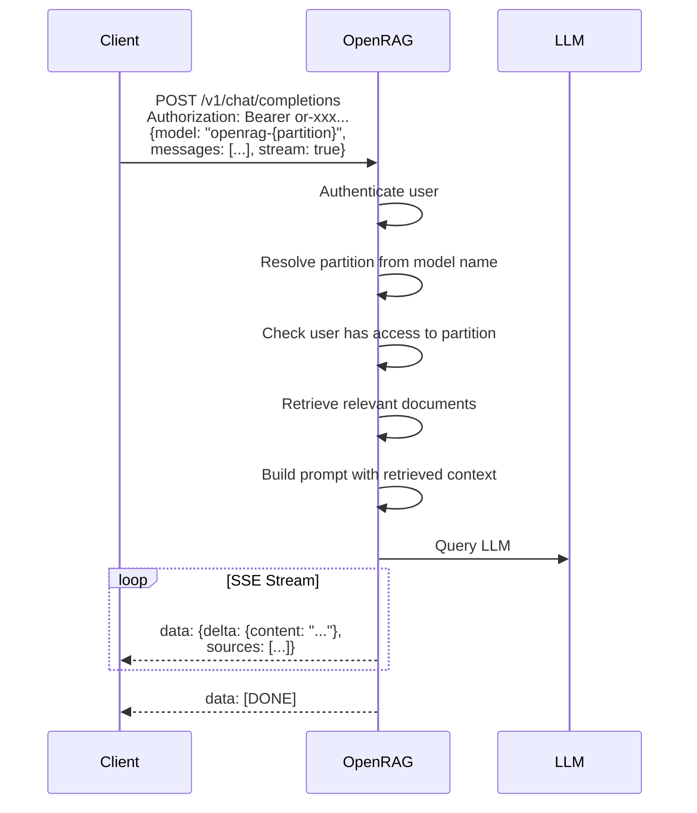

The FastAPI-powered backend provides a comprehensive document-based question answering system using Retrieval-Augmented Generation (RAG). The API supports semantic search, document indexing, and chat completions across multiple data partitions with full OpenAI compatibility.

## 🔐 Authentication

Protected endpoints require authentication by default. Set `AUTH_TOKEN` in your `.env` and include it in the HTTP request header:

```http
Authorization: Bearer YOUR_AUTH_TOKEN
```

For OpenAI-compatible endpoints, `AUTH_TOKEN` serves as the `api_key` parameter. Local no-auth development requires the explicit `ALLOW_NO_AUTH=true` opt-in; otherwise an empty token fails closed.

---

## 📡 API Serving Modes
This API can be served using **Uvicorn** (default) or **Ray Serve** for distributed deployments.

By default, the backend uses `uvicorn` to serve the FastAPI app.

To enable **Ray Serve**, set the following environment variable:

```bash
// .env
ENABLE_RAY_SERVE=true
```

Additional optional environment variables for configuring Ray Serve:

```bash
// .env
RAY_SERVE_NUM_REPLICAS=1             # Number of deployment replicas
RAY_SERVE_HOST=0.0.0.0               # Host address for Ray Serve HTTP proxy
RAY_SERVE_PORT=8080                  # Port for Ray Serve HTTP proxy
```

When using Ray Serve with a **remote cluster**, the HTTP server will be started on the **head node** of the cluster.


## 🚀 API Endpoints
### ℹ️ System Health
Verify server status and availability.
```http
GET /health_check
```

Use readiness when deciding whether the API should receive traffic:

```http
GET /ready
```

Readiness returns 503 when PostgreSQL, Milvus, or Ray is unavailable. It also
reports the health of default and partition-referenced inference endpoints, plus
broken preset references. Those model findings are informational because one
tenant's configuration must not remove a healthy shared API replica from
service.

### ℹ️ openRAG version

Get openRAG version
```http
GET /version
```

### ⚙️ Configuration

Get the current application configuration. Sensitive fields (`api_key`, `password`, `token`) are redacted.

```http
GET /config
```

**Permissions:** Requires admin role

**Response:** JSON object with all configuration sections (LLM, embedder, vector DB, chunker, retriever, etc.)

---

### 📦 Document Indexing

#### Upload New File
```http
POST /indexer/partition/{partition}/file/{file_id}
```

Upload a new file to a specific partition for indexing.

**Parameters:**
- `partition` (path): Target partition name
- `file_id` (path): Unique identifier for the file

**Request Body (form-data):**
- `file` (binary): File to upload
- `metadata` (JSON string): File metadata (e.g., `{"owner": "user1"}`)
- `workspace_ids` (JSON array, optional): Workspaces to add the file to
- `callback_url` (string, optional): URL notified once indexing reaches a terminal state
- `callback_token` (string, optional): Bearer token for that notification

**Responses:**
- `201 Created`: Returns task status URL
- `400 Bad Request`: `callback_url` is malformed or not a public `http(s)` URL
- `409 Conflict`: File already exists in partition

##### Indexing status callback

Indexing is asynchronous. Pass a `callback_url` and OpenRAG POSTs the outcome
once the task settles, so a client can wait instead of polling:

```json
{
  "partition": "alice.example.org",
  "file_id": "file-123",
  "status": "success",
  "metadata": {"doc_rev": "<revision>", "datetime": "...", "doctype": "..."}
}
```

`status` is `"success"` or `"error"`; a user-cancelled task sends nothing.
`metadata` is whatever you sent at upload, echoed back unchanged — including
a revision-tracking field under any name you like, if that's how your receiver
orders these callbacks (the example above uses `doc_rev`). A field you didn't
send is simply absent, not sent back as `null`. Only server-computed keys are
held back: the on-disk path, content hash, file size, filenames, and
`file_id` (already a top-level field).

For an authenticated target, pass `callback_token` — sent as `Authorization:
Bearer <token>`, never in the URL or the payload. Picking a safe scheme for it
is on the caller: `callback_url` is otherwise unchecked beyond the public
`http(s)` requirement below.

Best-effort: one attempt, no retries, a 5 s deadline, and any failure is
logged without affecting the indexing result. Delivery is not guaranteed, so
keep a client-side timeout and fall back to polling the task-status URL. The
`callback_url` is checked against the SSRF guard and must be a public
`http(s)` address — see
[`INDEXING_CALLBACK_ALLOW_PRIVATE_URLS`](/openrag/documentation/env_vars) to
target a local instance in development.

##### Temporal Filtering
OpenRAG supports temporal filtering to retrieve documents from specific time periods.
The client can include the temporal field to allow temporal-aware search in search endpoints.

* `created_at`: ISO 8601 format date of when the file was created

:::info
`created_at` is provided by the client in the metadata of the file during upload.
This is a first iteration — additional temporal fields (e.g. `updated_at`) may be added in future releases as needed.
:::


##### Upload files while modeling relations between them

OpenRAG supports document relationships to enable context-aware retrieval.
You can model relationships between files using the `metadata` field during upload. Different relationship types can be represented using the `relationship_id` and `parent_id` metadata fields, depending on the use case: folder-based relationships, email threads, etc. (see [Document Relationships documentation](/openrag/documentation/linked_files/#examples) for more details).

* To represent native [simple folder-based relationships between files](/openrag/documentation/linked_files/#-folder-based-organization), rely exclusively on `relationship_id`:

```http
POST /indexer/partition/{partition}/file/{file_id}
Authorization: Bearer YOUR_AUTH_TOKEN
Content-Type: multipart/form-data

file: <binary data>
metadata: {
  "relationship_id": "documents/projects/2024/q1",
  ...
}
```

* for email threads, one can rely on both `relationship_id` (to group emails in the same thread) and `parent_id` (to model reply hierarchies within the thread). See the [Document Relationships documentation](/openrag/documentation/linked_files/#-email-threads) for more details and examples.

**Example: Original Email (Root)**
```http
POST /indexer/partition/emails/file/email_a_id
Authorization: Bearer YOUR_AUTH_TOKEN
Content-Type: multipart/form-data

file: <email binary data>
metadata: {
  "relationship_id": "thread-123",
  "parent_id": null,
  ...
}
```

**Example: Reply Email (Child)**
```http
POST /indexer/partition/emails/file/email_b_id
Authorization: Bearer YOUR_AUTH_TOKEN
Content-Type: multipart/form-data

file: <email binary data>
metadata: {
  "relationship_id": "thread-123",
  "parent_id": "email_a_id",
  ...
}
```
For context-aware search, see [search endpoints](#-semantic-search) and [relationship-based file fetching](#partitions--files-management). 

#### Replace Existing File
```http
PUT /indexer/partition/{partition}/file/{file_id}
```

Replace an existing file in the partition. Deletes the current entry and creates a new indexing task.

**Parameters:** Same as POST endpoint
**Request Body:** Same as POST endpoint
**Response:** `202 Accepted` with task status URL

#### Update File Metadata
```http
PATCH /indexer/partition/{partition}/file/{file_id}
```

Update file metadata without reindexing the document.

**Request Body (form-data):**
- `metadata` (JSON string): Updated metadata

**Response:** `200 OK` on successful update

#### Delete File
```http
DELETE /indexer/partition/{partition}/file/{file_id}
```

Remove a file from the specified partition.

**Responses:**
- `204 No Content`: Successfully deleted
- `404 Not Found`: File not found in partition

#### Check Indexing Status
```http
GET /indexer/task/{task_id}
```

Monitor the progress of an asynchronous indexing task.

**Response:** Task status information

---

#### Get error details of a failed task 
```http
GET /indexer/task/{task_id}/error
```


### 🔍 Semantic Search

* Search Across Multiple Partitions
```http
GET /search/
```

Perform semantic search across specified partitions.

**Query Parameters:**
| Parameter           | Type    | Default | Description |
|---------------------|---------|---------|-------------|
| `partitions` (optional)        | array   | ["all"] | Partitions to search. (optional) |
| `text`              | string  | required | Search query |
| `top_k` (optional)             | integer | 5       | Number of initial results (optional) |
| `include_related` (optional)   | boolean | `false`   | Include chunks from files with same `relationship_id` |
| `include_ancestors` (optional) | boolean | `false`   | Include chunks from ancestor files (via `parent_id` chain) |
| `related_limit` (optional)     | integer | 20      | Max related/ancestor chunks to fetch per result (used when `include_related` or `include_ancestors` is true) |
| `filter` (optional)            | string  | None    | Milvus filter expression string for additional filtering. Supports comparison (`==`, `!=`, `>`, `<`, `>=`, `<=`), range (`IN`, `LIKE`), and logical (`AND`, `OR`, `NOT`) operators. |

**Responses:**
- `200 OK`: JSON list of document links (HATEOAS format)
- `400 Bad Request`: Invalid partitions parameter

* Search Within Single Partition
```http
GET /search/partition/{partition}
```

Search within a specific partition only.

**Query Parameters:**

| Parameter           | Type    | Default | Description |
|---------------------|---------|---------|-------------|
| `text`              | string  | required | Search query |
| `top_k` (optional)             | integer | 5       | Number of initial results (optional) |
| `include_related` (optional)   | boolean | `false`   | Include chunks from files with same `relationship_id` |
| `include_ancestors` (optional) | boolean | `false`   | Include chunks from ancestor files (via `parent_id` chain) |
| `related_limit` (optional)     | integer | 20      | Max related/ancestor chunks to fetch per result (used when `include_related` or `include_ancestors` is true) |
| `filter` (optional)            | string  | None    | Milvus filter expression string for additional filtering. Supports comparison (`==`, `!=`, `>`, `<`, `>=`, `<=`), range (`IN`, `LIKE`), and logical (`AND`, `OR`, `NOT`) operators. |

**Response:** Same as multi-partition search

* Search Within Specific File
```http
GET /search/partition/{partition}/file/{file_id}
```

Search within a particular file in a partition.

**Query Parameters:** Same as partition search, including `filter`.
**Response:** Same as other search endpoints

---

### 📄 Document Extraction

Extracts are the individual chunks a document is split into during indexing. Each has a stable `extract_id`, surfaced as the `link` on search results and on the file/chunk-listing endpoints below.

#### Get Extract Details
```http
GET /extract/{extract_id}
```

Retrieve a specific document extract (chunk) by its ID.

**Parameters:**
- `extract_id` (path): The unique chunk identifier (from search or chunk-listing results)

**Permissions:** Requires access to the partition containing the chunk — regular users are limited to their assigned partitions; admins can read any chunk.

**Response:** `200 OK`
```json
{
  "page_content": "The text content of the chunk…",
  "metadata": {
    "file_id": "doc-a-id",
    "filename": "Document A.pdf",
    "partition": "my_partition",
    "page": 3,
    "indexed_at": "2026-01-01T12:00:00Z"
  }
}
```

**Errors:**
- `403 Forbidden`: You don't have access to the chunk's partition
- `404 Not Found`: No extract with that ID

---

### Partitions & files Management

Partitions are the multi-tenant document collections OpenRAG indexes into. All routes below are prefixed with **`/partition`**. Access is role-based (hierarchy `owner` > `editor` > `viewer`): **viewer** for reads, **owner** for partition deletion, config changes, and member management. Admins with `SUPER_ADMIN_MODE=true` bypass membership checks.

#### List Partitions
```http
GET /partition/
```
List the partitions you can access — admins see all partitions, regular users see only their memberships. Each entry includes `partition`, `document_count`, and (for non-admins) your `role`.

#### Create Partition
```http
POST /partition/{partition}
```
Create an empty partition; you automatically become its **owner**. Returns `201 Created`, or `409 Conflict` if the name is taken. Non-admins are capped by [`MAX_PARTITIONS_PER_USER`](/openrag/documentation/env_vars/) (a `403` is returned when the cap is reached).

#### Delete Partition
```http
DELETE /partition/{partition}
```
Permanently delete a partition and **all** its files and chunks. **Owner** only. Returns `204 No Content`. This cannot be undone.

#### List Files in a Partition
```http
GET /partition/{partition}
```
**Viewer**+. **Query:** `limit` (optional). Returns `{ "files": [ { "file_id", "filename", "link", … } ] }`, where `link` points at the file-detail endpoint below.

#### Get File Details & Chunks
```http
GET /partition/{partition}/file/{file_id}
```
**Viewer**+. **Query:** `limit` (max chunks, default `2000`). Returns `{ "metadata": {…}, "documents": [ { "link": "…/extract/{id}" } ] }`. Returns `404` if the file isn't in the partition.

#### List Chunks in a Partition
```http
GET /partition/{partition}/chunks
```
List document chunks (extracts) in a partition. **Viewer**+.

**Query Parameters:**
| Parameter | Type | Default | Description |
|-----------|------|---------|-------------|
| `include_embedding` | boolean | `true` | Include each chunk's vector embedding |
| `file_id` | string | None | Restrict to a single file's chunks (recommended for the document-detail view) |
| `limit` | integer | unbounded | Max chunks to return |

Returns `{ "chunks": [ { "content", "metadata", "link", "embedding"? } ] }`. Note the chunk text is under `content` here, whereas the single-chunk `GET /extract/{extract_id}` endpoint returns it under `page_content`.

:::caution
Without `file_id` or `limit` this can return a large amount of data for partitions with many documents.
:::

#### Partition Pipeline Config

Each partition references an **indexation** and a **retrieval** [preset](#-pipeline-presets), plus an embedder and chat LLM.

* Get resolved config
```http
GET /partition/{partition}/config
```
**Viewer**+. Returns the partition's preset references and the fully resolved indexation/retrieval pipeline configuration.

* Update config
```http
PATCH /partition/{partition}
```
**Owner** only. Body fields (all optional): `description`, `embedder`, `indexation_preset`, `retrieval_preset`, `chat_history_depth`, `chat_llm`. Returns the updated resolved config. Changing `embedder` is refused on a partition that holds indexed files (`409 PARTITION_HAS_INDEXED_FILES`, or `409 INDEXING_IN_PROGRESS` while files are still being indexed or copied into it): each embedder keeps its vectors in its own field, which only its partitions search.

```bash frame="none"
curl -X PATCH http://localhost:8080/partition/my_partition \
  -H "Authorization: Bearer YOUR_AUTH_TOKEN" \
  -H "Content-Type: application/json" \
  -d '{"indexation_preset": "legal", "retrieval_preset": "hyde"}'
```

#### Partition Members

Manage who can access a partition and with which role — all **owner** only.

| Endpoint | Method | Description |
|----------|--------|-------------|
| `/partition/{partition}/users` | GET | List members → `{ "members": [...] }` |
| `/partition/{partition}/users/candidates` | GET | Search non-members by display-name prefix or exact user ID → paginated identities |
| `/partition/{partition}/users` | POST | Add a new member → `201`; returns `409` if already present |
| `/partition/{partition}/users/{user_id}` | PATCH | Update a member's role — form field `role` → `200` |
| `/partition/{partition}/users/{user_id}` | DELETE | Remove a member → `204` |

`POST` no longer updates an existing member's role. Use the `PATCH` endpoint when changing a role.

#### Document Relationships

* Get Files by Relationship

```http
GET /partition/{partition}/relationships/{relationship_id}
```

Returns all files sharing the same `relationship_id` within a partition. **Viewer**+.

**Parameters:**
- `partition` — partition name
- `relationship_id` — the relationship group identifier (client-defined)

**Response:**
```json
{
  "files": [
    {
      "file_id": "doc-a-id",
      "filename": "Document A",
      "relationship_id": "group-123",
      "parent_id": null
    },
    {
      "file_id": "doc-b-id",
      "filename": "Document B",
      "relationship_id": "group-123",
      "parent_id": "doc-a-id"
    }
  ]
}
```

* Get File Ancestors

```http
GET /partition/{partition}/file/{file_id}/ancestors
```

Returns the complete ancestor path from root to the specified file. **Viewer**+.

:::note
Returns only the direct ancestor path, not sibling branches.
:::

**Parameters:**
- `partition` — partition name
- `file_id` — the file to trace ancestors for
- `max_ancestor_depth` (optional) — limit on ancestor depth to return. None means unlimited.

**Response:**
```json
{
  "ancestors": [
    {
      "file_id": "email-a-id",
      "filename": "Original Email",
      "parent_id": null
    },
    {
      "file_id": "email-b-id",
      "filename": "First Reply",
      "parent_id": "email-a-id"
    },
    {
      "file_id": "email-c-id",
      "filename": "Second Reply",
      "parent_id": "email-b-id"
    }
  ]
}
```

---

### 🧩 Pipeline Presets

Named, reusable **indexation** and **retrieval** pipeline configurations. Partitions reference a preset by name (see [`PATCH /partition/{partition}`](#partition-pipeline-config)) instead of carrying an inline config, so a change to a preset propagates to every partition using it. Six defaults are seeded on first boot (`default`, `legal`, `finance` for indexation; `default`, `multiquery`, `hyde` for retrieval); the `default` preset of each type cannot be deleted or renamed.

All routes are prefixed with **`/presets`** and require the **admin** role. `preset_type` is one of `indexation` | `retrieval`.

#### List available strategy options
```http
GET /presets/options
```
Returns the choices valid inside a preset `config`: `chunking_strategies`, `parsing_strategies` (`pymupdf`, `marker`, `docling`), `retrieval_types`, and `reranker_providers`.

#### Create a preset
```http
POST /presets/
```
**Body:** `name` (string), `preset_type` (`indexation` | `retrieval`), `config` (object — its keys depend on the type). Returns `201 Created` with the stored preset.

```bash frame="none" title="Create a retrieval preset"
curl -X POST http://localhost:8080/presets/ \
  -H "Authorization: Bearer YOUR_AUTH_TOKEN" \
  -H "Content-Type: application/json" \
  -d '{
    "name": "hyde-large",
    "preset_type": "retrieval",
    "config": {"type": "hyde", "top_k": 50, "top_n": 10}
  }'
```

An indexation `config` instead accepts keys such as `chunking` (`{name, chunk_size, chunk_overlap_rate}`), `parsing_strategy`, `stt` (a named STT endpoint), `asr_transcription_prompt_name`, `enable_image_captioning`, `enable_contextualization`, and `contextualization_mode`. Omitting `stt` or `asr_transcription_prompt_name` uses the corresponding global default. The STT and ASR prompt selections apply only to audio or video files routed to `OpenAIAudioLoader`; `LocalWhisperLoader` does not use them.

#### List presets
```http
GET /presets/
```
**Query:** `preset_type` (optional) to filter by type. Returns a list of presets with `name`, `preset_type`, `config`, `created_at`, `updated_at`.

#### Get / Update / Delete a preset
```http
GET    /presets/{preset_type}/{name}
PUT    /presets/{preset_type}/{name}
DELETE /presets/{preset_type}/{name}
```
`PUT` accepts a partial body (`name` to rename and/or `config`; at least one required) and returns the updated preset. `DELETE` returns `204 No Content`.

---

### 📝 Prompt Library

Every prompt the pipeline sends to a model is a stored, editable row rather than a bundled file. On first boot each type is seeded from its bundled template as that type's **default**; an admin can add named variants and select one per preset or per partition.

All routes are prefixed with **`/prompts`** and require the **admin** role. `prompt_type` is one of `sys_prompt` | `spoken_style_answer` | `query_contextualizer` | `chunk_contextualizer` | `image_captioning` | `hyde` | `multi_query` | `topic_tagger` | `asr_transcription`.

**Resolution order** for a given type: the name selected for the request → the type's global default → the bundled template. A selection naming a prompt that no longer exists falls back to the default rather than failing.

**Where a prompt is selected** — each setting lives with the thing it configures:

| Prompt type | Selected on |
|---|---|
| `sys_prompt`, `spoken_style_answer` | partition — `generation_prompt_names` |
| `query_contextualizer`, `hyde`, `multi_query` | retrieval preset — `*_prompt_name` |
| `chunk_contextualizer`, `image_captioning`, `topic_tagger` | indexation preset — `*_prompt_name` |
| `asr_transcription` | indexation preset — `asr_transcription_prompt_name` for audio or video files routed to `OpenAIAudioLoader` |

#### Create a prompt
```http
POST /prompts/
```
**Body:** `prompt_type`, `name`, `content`, `is_default` (default `false`). Returns `201 Created`, or `409` if that `(prompt_type, name)` already exists.

Types rendered as templates (`sys_prompt`, `spoken_style_answer`, `query_contextualizer`, `hyde`, `multi_query`) accept only their own **plain** `{placeholders}` — no conversion (`!r`), format spec (`:>10`) or attribute access — and a violation returns `422` at write time rather than failing later at render. Escape a literal brace as `{{` / `}}`. The remaining types are sent to the model verbatim. `asr_transcription` may be empty, which keeps the transcription model's native prompt.

```bash frame="none"
curl -X POST http://localhost:8080/prompts/ \
  -H "Authorization: Bearer YOUR_AUTH_TOKEN" \
  -H "Content-Type: application/json" \
  -d '{
    "prompt_type": "sys_prompt",
    "name": "legal-assistant",
    "content": "Answer strictly from the context.\n{context}\nToday is {current_date}."
  }'
```

#### List / Get / Update / Delete
```http
GET    /prompts/                 # ?prompt_type= to filter, ?offset= &limit= to page (limit ≤ 500)
GET    /prompts/{prompt_id}
PATCH  /prompts/{prompt_id}      # any of name, content, is_default
DELETE /prompts/{prompt_id}      # 204 No Content; refused for a type's current default
```
List entries carry `used_by` — the number of partitions that resolve to that prompt, counting those that fall back to it as the default.

#### Promote to default for its type
```http
PUT /prompts/{prompt_id}/default
```
Clears the previous default for that type and promotes this one, atomically.

#### Selecting a prompt for a partition
```http
PATCH /partition/{partition}
```
Send `generation_prompt_names`, a map of `{prompt_type: name}` restricted to `sys_prompt` and `spoken_style_answer`. Each name must exist, or the request returns `422`. Send `{}` to clear the selection and fall back to the defaults.

```bash frame="none"
curl -X PATCH http://localhost:8080/partition/my-partition \
  -H "Authorization: Bearer YOUR_AUTH_TOKEN" \
  -H "Content-Type: application/json" \
  -d '{"generation_prompt_names": {"sys_prompt": "legal-assistant"}}'
```

Preset-scoped prompts are selected the same way, by putting the `*_prompt_name` field in the preset's `config` (see [Pipeline Presets](#-pipeline-presets)). For audio or video files routed to `OpenAIAudioLoader`, the indexation preset also selects the ASR prompt and STT endpoint. `LocalWhisperLoader` uses neither setting.

---

### 🔌 Model Endpoints

A registry of named inference endpoints (embedder, reranker, LLM, VLM, STT) that partitions and presets can point at, so operators can manage and switch inference backends at runtime instead of via `.env`. Stored API keys are **redacted** in every response and only returned through the explicit reveal action below.

All routes are prefixed with **`/model-endpoints`** and require the **admin** role. `model_type` is one of `embedder` | `reranker` | `llm` | `vlm` | `stt`.

#### Register an endpoint
```http
POST /model-endpoints/
```
**Body:** `name`, `model_type`, `endpoint` (URL), `model_name` (optional), `batch_size` (default `32`), `timeout` (seconds, default `30`), `extra` (object — put `api_key` here), `is_default` (default `false`). Returns `201 Created`; the response carries `has_api_key` rather than the key itself.

```bash frame="none"
curl -X POST http://localhost:8080/model-endpoints/ \
  -H "Authorization: Bearer YOUR_AUTH_TOKEN" \
  -H "Content-Type: application/json" \
  -d '{
    "name": "prod-embedder",
    "model_type": "embedder",
    "endpoint": "https://vllm.internal/v1",
    "model_name": "jinaai/jina-embeddings-v3",
    "extra": {"api_key": "sk-…"}
  }'
```

#### List / Get / Update / Delete
```http
GET    /model-endpoints/                       # ?model_type= to filter
GET    /model-endpoints/{model_type}/{name}
PUT    /model-endpoints/{model_type}/{name}
DELETE /model-endpoints/{model_type}/{name}    # 204 No Content
```
`PUT` takes a partial body (any of the create fields, plus `name` to rename) and returns the updated endpoint.

Changing an **embedder**'s `endpoint`, `model_name`, `extra.implementation` or `extra.max_model_len` changes the vectors it produces. While partitions hold files indexed with it, such an edit returns `409 EMBEDDER_EDIT_AFFECTS_INDEXED_DATA` naming the partitions and file counts; resend it with `"acknowledge_indexed_data": true` to apply it anyway. The existing vectors are not rebuilt, so queries on those partitions are then compared against vectors from the previous configuration. `GET /model-endpoints/{model_type}/{name}/indexed-usage` returns the same counts ahead of time.

Files still indexing when such an edit is saved are not counted, since a file is only counted once indexing finishes. Instead, when the file is recorded, the indexer checks that the partition's embedder still has the configuration it embedded with. If it doesn't, the file fails with `EMBEDDER_CHANGED_DURING_INDEXING`, its vectors are removed, and it has to be indexed again. Indexers reload an edited endpoint before embedding, so only files already embedding during the edit are affected.

`DELETE` of an embedder returns `409` while a partition names it or, for the default embedder, while a partition following the `default` alias already holds indexed files. Reassign those partitions first. Deleting an embedder also drops its vector field from the collection, on a best-effort basis: if the drop fails, the delete still succeeds and the empty field stays until removed by hand.

#### Set as default for its type
```http
POST /model-endpoints/{model_type}/{name}/set-default
```
Promotes the endpoint to the default used for its `model_type`, and returns it.

For embedders, a new default only reaches partitions that have no data yet. A partition stays on the `default` alias until it first receives a file (upload or copy), at which point the alias is replaced by the embedder it resolved to; a partition indexed before that is pinned the same way when the default changes. Partitions with files therefore keep the embedder that built their vectors. An emptied partition stays pinned — set its `embedder` back to `default` to follow the default again.

#### Reveal the stored API key
```http
POST /model-endpoints/{model_type}/{name}/reveal-api-key
```
Explicit admin action that returns `{ "api_key": "…" }` (or `null` if none is stored). This is the only endpoint that returns the key in clear text; the action is logged.

#### Validate connectivity
```http
POST /model-endpoints/validate                          # probe a draft (unsaved) endpoint
POST /model-endpoints/{model_type}/{name}/validate      # probe a registered endpoint
```
Both probe the target for reachability and model availability, returning `{ "reachable", "model_found", "models_served", "detail" }`. The draft form takes `endpoint` (+ optional `model_name`, `api_key`); to reuse a saved key without resending it, pass `stored_api_key_model_type` and `stored_api_key_name` (both required together, and only accepted when the draft `endpoint` matches the saved one).

---

### 💬 OpenAI-Compatible Chat

These endpoints provide full OpenAI API compatibility for seamless integration with existing tools and workflows. For detailed example of openai usage [see this section](#example-openai-client-usage)

* List Available Models
```http
GET /v1/models
```

List all available RAG models (partitions).

**Model Naming Convention:**
- Pattern: `openrag-{partition_name}` => This model allows to chat specifically with the partition `{partition_name}`
- Special model: `partition-all` (queries entire vector database)

* Chat Completions
```http
POST /v1/chat/completions
```

OpenAI-compatible chat completion using **`RAG` pipeline**.

**Request Body:**
```bash frame="none" title="Testing the openai OpenRAG chat completions endpoint with curl"
curl -X POST http://localhost:8080/v1/chat/completions \
  -H "Content-Type: application/json" \
  -H "Authorization: Bearer YOUR_AUTH_TOKEN" \
  -d '{
    "model": "openrag-{partition_name}",
    "messages": [
      {
        "role": "user",
        "content": "Your question here"
      }
    ],
    "temperature": 0.1,
    "stream": false
  }'
```

You can also direclty use this endpoint with no RAG pipeline, i.e. to directly use the LLM.
For that, instead of using the `openrag` prefix for the model, you can:
- Specify no model
- Specify an empty model
- Specify the openRAG configured model, e.g. `Mistral-Small-3.1-24B-Instruct-2503`.

**Request Body:**
```bash frame="none" title="Testing the openai OpenRAG chat completions endpoint with curl"
curl -X POST http://localhost:8080/v1/chat/completions \
  -H "Content-Type: application/json" \
  -H "Authorization: Bearer YOUR_AUTH_TOKEN" \
  -d '{
    "model": "",
    "messages": [
      {
        "role": "user",
        "content": "Your question here"
      }
    ],
    "temperature": 0.1,
    "stream": false
  }'
```


* Text Completions
```http
POST /v1/completions
```
OpenAI-compatible text completion endpoint.

#### Extra arguments

* When using `/v1/chat/completions` or `/v1/completions`, you can pass extra arguments **via the `metadata` field** of the request body to customize the RAG behavior. Some options apply only to chat, as shown below:

Partition-backed chat retrieves by default. It skips retrieval only for an empty or exclusively casual message;
ambiguous, mixed, and factual messages retrieve. Text completions retain their contextualizer-controlled default.

| Option | Applies to | Type | Default | Description |
|--------|------------|------|---------|-------------|
| `require_retrieval` | Chat and text completions | `bool` | `false` | For partition-backed chat, JSON `true` forces retrieval even for a casual or normalized-empty message. Other chat messages already retrieve by default. For text completions, JSON `true` remains the opt-in override when the contextualizer would skip. The original input is the fallback query. Existing scope and filters still apply; matching sources and answer correctness are not guaranteed. Has no effect in direct LLM mode. |
| `websearch` | Chat only | `bool` | `false` | Augments the RAG context with live web search results. When used with a partition (`openrag-{partition}`), document and web results are combined. When used without a partition (direct LLM mode), web results are the sole context. Requires `WEBSEARCH_API_TOKEN` to be configured. See [web search configuration](/openrag/documentation/env_vars/#web-search-configuration). |
| `spoken_style_answer` | Chat and text completions | `bool` | `false` | Generates a succinct spoken-style conversational answer based on the retrieved documents. |
| `use_map_reduce` | Chat only | `bool` | `false` | Uses a map-reduce strategy to aggregate information from multiple documents. See [map-reduce configuration](/openrag/documentation/env_vars/#map--reduce-configuration). |
| `llm_override` | Chat and text completions | `object` | `null` | Overrides the downstream LLM for this request. Accepts `model` (string), always honored. Also accepts `base_url` and `api_key`, which are honored **only** when the deployment sets `LLM_OVERRIDE_ALLOW_CUSTOM_ENDPOINT` — otherwise they are ignored and the request goes to the server's configured endpoint. See [custom LLM endpoints](/openrag/documentation/env_vars/#client-supplied-llm-endpoints). |
| `attachments` | Chat only | `list[{"id": string}]` | `null` | Scopes RAG retrieval to a specific list of file IDs within the target partition, instead of searching the whole partition. Unknown or unindexed IDs are silently dropped; duplicates are deduplicated. The response's `extra.attachments` reports which IDs were actually used. |

Common English and French casual messages are recognized directly; other phrasing is checked conservatively by the
contextualizer. Casual replies use a dedicated instruction in the detected language. Only greetings introduce
OpenRAG, and ambiguous or normalized-empty input defaults to English.

Examples:

```bash title="Enabling conversational answer with openai chat completions endpoint"
curl -X 'POST' 'http://localhost:8080/v1/chat/completions' \
  -H 'accept: application/json' \
  -H 'Authorization: Bearer YOUR_AUTH_TOKEN' \
  -H 'Content-Type: application/json' \
  -d '{
  "model": "openrag-{partition_name}",
  "messages": [
    {
      "role": "user",
      "content": "your_query"
    }
  ],
  "temperature": 0.3,
  "stream": false,
  "metadata": {
    "spoken_style_answer": true
  }
}'
```

```bash title="Enabling web search with RAG documents"
curl -X 'POST' 'http://localhost:8080/v1/chat/completions' \
  -H 'accept: application/json' \
  -H 'Authorization: Bearer YOUR_AUTH_TOKEN' \
  -H 'Content-Type: application/json' \
  -d '{
  "model": "openrag-{partition_name}",
  "messages": [
    {
      "role": "user",
      "content": "your_query"
    }
  ],
  "stream": false,
  "metadata": {
    "websearch": true
  }
}'
```

```bash title="Web search only (no RAG partition)"
curl -X 'POST' 'http://localhost:8080/v1/chat/completions' \
  -H 'accept: application/json' \
  -H 'Authorization: Bearer YOUR_AUTH_TOKEN' \
  -H 'Content-Type: application/json' \
  -d '{
  "model": "",
  "messages": [
    {
      "role": "user",
      "content": "your_query"
    }
  ],
  "stream": false,
  "metadata": {
    "websearch": true
  }
}'
```

```bash title="Using another configured LLM model with OpenRAG's RAG pipeline"
curl -X 'POST' 'http://localhost:8080/v1/chat/completions' \
  -H 'accept: application/json' \
  -H 'Authorization: Bearer YOUR_AUTH_TOKEN' \
  -H 'Content-Type: application/json' \
  -d '{
  "model": "openrag-{partition_name}",
  "messages": [
    {
      "role": "user",
      "content": "your_query"
    }
  ],
  "stream": false,
  "metadata": {
    "llm_override": {
      "model": "gpt-4o"
    }
  }
}'
```

With `LLM_OVERRIDE_ALLOW_CUSTOM_ENDPOINT=true`, the same object may also carry the
endpoint and its credential, sending the request to a provider of the client's
choosing instead of the configured one:

```json title="metadata.llm_override with a client-supplied endpoint"
{
  "llm_override": {
    "base_url": "https://api.openai.com/v1",
    "api_key": "sk-...",
    "model": "gpt-4o"
  }
}
```

`base_url` must be `https`, must carry no query string, fragment or `..` path
segment (percent-encoded or not), and is always requested as
`{base_url}/chat/completions` — `{base_url}/completions` when the request comes
in on the legacy `/v1/completions` route; anything else is rejected with a
**400**. The server's own API key is never forwarded — an override without
`api_key` sends no `Authorization` header at all. When the flag
is off, `base_url`/`api_key` are ignored (a warning is logged) and only `model`
applies, which typically surfaces as an "unknown model" error from the configured
provider.

```bash title="Scoping retrieval to specific attachments"
curl -X 'POST' 'http://localhost:8080/v1/chat/completions' \
  -H 'accept: application/json' \
  -H 'Authorization: Bearer YOUR_AUTH_TOKEN' \
  -H 'Content-Type: application/json' \
  -d '{
  "model": "openrag-{partition_name}",
  "messages": [
    {
      "role": "user",
      "content": "summarize these files"
    }
  ],
  "stream": false,
  "metadata": {
    "attachments": [
      {"id": "file-001"},
      {"id": "file-002"},
      {"id": "file-003"}
    ]
  }
}'
```


### 🔧 Tools

Tools are useful features that can be called directly by the client.


* List available tools
```http
GET /v1/tools
```

**Request:**
```bash frame="none"
curl http://localhost:8080/v1/tools
```

**Response:**
```json
[
    {
        "name": "Tool name",
        "description": "Tool description"
    }
]
```

* Execute a tool
```http
POST /v1/tools/execute
```

The parameters are given in multipart.

**Request:**
```bash frame="none"
curl -X POST http://localhost:8080/v1/tools/execute \
  -H "Content-Type: multipart/form-data" \
  -H "Authorization: Bearer YOUR_AUTH_TOKEN" \
  -F "file=@file.pdf" \
  -F 'tool={"name":"extractText"}' \
  -F 'metadata={"mime":"application/pdf","name":"test.pdf"}' \
```

**Response:**
```json
{
  "message": "File content"
}
```

## 💡 Usage Examples

#### Bulk File Indexing

For indexing multiple files programmatically, you can use the [`data_indexer.py`](http://github.com/linagora/openrag/blob/main/scripts/data_indexer.py) utility script in the [`scripts/`](https://github.com/linagora/openrag/tree/main/scripts) folder or simply use **`indexer ui`**.

#### Example OpenAI Client Usage

```python {9-10}
from openai import OpenAI, AsyncOpenAI

api_base_url = "http://localhost:8080" # fastapi base url of 'openrag'
base_url = f"{api_base_url}/v1"

auth_key = ... # your API authentication key AUTH_TOKEN from .env
client = OpenAI(api_key=auth_key, base_url=base_url)

your_partition= 'my_partition' # name of your partition
model = f"openrag-{your_partition}"
settings = {
    'model': model,
    'temperature': 0.3,
    'stream': False
}

response = client.chat.completions.create(
    **settings,
    messages=[
        {"role": "user", "content": "What information do you have about...?"}
    ]
)
```

---

## ⚠️ Error Handling

The API uses standard HTTP status codes:

- `200 OK`: Successful request
- `201 Created`: Resource created successfully
- `202 Accepted`: Request accepted for processing
- `204 No Content`: Successful deletion
- `400 Bad Request`: Invalid request parameters
- `404 Not Found`: Resource not found
- `409 Conflict`: Resource already exists

Error responses include detailed JSON messages to help with debugging and integration.


## Sequence diagrams

### External Indexing Flow

An external indexer uses an admin token to create a user, then uses the returned user token for all subsequent operations.



### Chat Completion Flow

Query indexed documents via the OpenAI-compatible chat completions endpoint.


