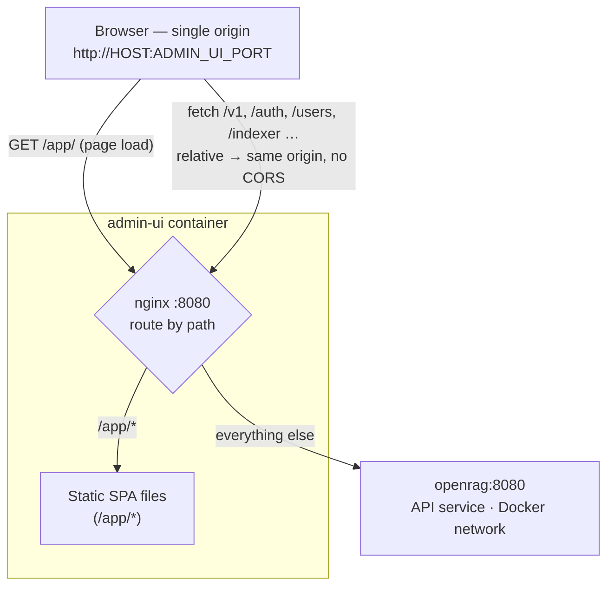

# Overview
OpenRAG provides a large range of environment variables that allow you to customize and configure various aspects of the application. This page serves as a comprehensive reference for all available environment variables, providing their types, default values, and descriptions. As new variables are introduced, this page will be updated to reflect the growing configuration options.

:::note
This page is up-to-date with OpenRAG v2.0.0. Types and defaults are cross-checked against `conf/config.yaml` and the config loader. Authentication and SSO variables (`AUTH_MODE`, `OIDC_*`) are documented separately in the [OIDC guide](/openrag/documentation/oidc/).
:::

# Secrets

OpenRAG validates its credentials once, at startup, and **refuses to start** on any value
published in this repository — the dev defaults in `.env.example`, the placeholders in the
Helm chart, and the values used in the documentation and the test stacks. The same check
runs at `helm template` time for the chart's `values` secrets provider.

This exists because the common way a deployment ends up with a known credential is not a
weak choice but no choice at all: a template copied verbatim. So the example files ship
`__GENERATE_ME__` where a credential belongs, and one command fills them in:

```bash
python3 scripts/gen_env.py           # writes infra/compose/.env
python3 scripts/gen_env.py --check   # verify nothing is left unset
```

## What must be supplied

| Variable | Required | Notes |
|---|---|---|
| `AUTH_TOKEN` | Yes, unless using SSO | Bootstraps the admin user and guards the API. Minimum 12 characters. Leaving it unset enables the no-auth development mode only when `ALLOW_NO_AUTH=true`. |
| `POSTGRES_PASSWORD` | Yes | Minimum 12 characters. Compose fails closed without it; the chart reads it from `postgresql.auth.password`. |
| `CHAINLIT_AUTH_SECRET` | When the chat interface is enabled | Signs the chat session cookie. Minimum 12 characters; generate with `python -c "import secrets; print(secrets.token_urlsafe(32))"`. Rotating it invalidates live sessions. In the Helm chart the chat interface is off by default (`env.WITH_CHAINLIT_UI`). |
| `MINIO_ACCESS_KEY` / `MINIO_SECRET_KEY` | Compose only | Shared by the MinIO service and Milvus — both sides must match. `MINIO_SECRET_KEY` has a 12-character minimum. Kubernetes deployments use external object storage instead. |
| `GRAFANA_ADMIN_PASSWORD` | When bundled Grafana is enabled | Minimum 12 characters. |
| `OIDC_CLIENT_SECRET`, `OIDC_TOKEN_ENCRYPTION_KEY` | SSO only | Formats are set by your identity provider and by Fernet respectively, so no length floor is applied. See the [OIDC guide](/openrag/documentation/oidc/). |
| `HF_TOKEN` | When pulling gated model weights | |
| `API_KEY`, `VLM_API_KEY`, `EMBEDDER_API_KEY`, `RERANKER_API_KEY`, `TRANSCRIBER_API_KEY`, `WEBSEARCH_API_TOKEN` | Per integration | Set by the provider, so no length floor. Use the literal `EMPTY` for a local OpenAI-compatible server that requires no credential — that is the documented sentinel and is always accepted. |

`UVICORN_FORWARDED_ALLOW_IPS` is not a secret but belongs in the same conversation: it
must name your proxy's subnet for session cookies and per-IP rate limits to behave
correctly behind a reverse proxy. See [FastAPI & Access Control](#fastapi--access-control).

## What will be refused

Any value this project publishes, matched case-insensitively — including the
`__GENERATE_ME__` marker itself — and any value shorter than 12 characters for the
variables marked with a minimum above. The canonical list lives in
`openrag/core/config/secrets_guard.py`; the chart carries the same list and a unit test
fails the build if the two disagree.

The startup error names the variables at fault and never prints their values.

## Overriding the check

`ALLOW_INSECURE_SECRETS=true` downgrades the refusal to a warning logged on every boot.
It is an opt-out, never an opt-in: an unset value means the check is enforced. Use it for
disposable development and CI stacks — the bundled API test stack sets it — and not in a
deployment that holds real data.

# Backend
## Indexer Pipeline
### Loaders
Openrag loads all files into a pivot markdown file format before proceeding to chunking. Some environment variables can be configured to customized this pipeline

#### General variables

| Variable | Type | Default | Description |
|----------|------|---------|-------------|
| `IMAGE_CAPTIONING` | `bool` | `true` | If `true`, an LLM is used to describe images and convert them into text using a [specific prompt](https://github.com/linagora/openrag/blob/main/openrag/prompts/templates/image_captioning_tmpl.txt). The image in files are replaced by their descriptions |
| `IMAGE_CAPTIONING_URL` | `bool` | `true` | If `true`, HTTP/HTTPS image URLs in markdown files are fetched and described by the VLM. |
| `SAVE_MARKDOWN` | `bool` | `false` | If `true`, the pivot-format markdown produced during parsing is saved. Useful for debugging and verifying the correctness of the generated markdown. |
|`SAVE_UPLOADED_FILES`|`bool`|`true`| When `true`, uploaded files are stored on disk. You must enable this option if you want Chainlit to show sources while chatting.|
| `CONTENT_DEDUPLICATION_ENABLED` | `bool` | `true` | Rejects a file when identical content already exists in the same partition. Set it to `false` when a test intentionally indexes duplicates. |
| `PDFLOADER` | `str` | `PyMuPDFLoader` | PDF parsing engine. `PyMuPDFLoader` (default) is a lightweight, fast, CPU-friendly backend for searchable PDFs. Switch to `MarkerLoader` for OCR / scanned documents, complex layouts and embedded images (heavier; GPU-friendly). Other options: `DoclingLoader`, `DotsOCRLoader`.|
| `PARSE_TIMEOUT` | `int` | `3600` | Outer wall-clock bound (in seconds) for a single file's parse stage, whichever loader runs it. Marker and Docling self-limit via their own timeouts, but `PyMuPDFLoader` has none — this bound stops a wedged parse from stalling indexing: the file fails and is reported instead. |
| `INDEXING_CALLBACK_ALLOW_PRIVATE_URLS` | `bool` | `false` | Development-only escape hatch for the upload `callback_url`. By default a callback targeting `localhost`, a private or link-local address is refused (SSRF guard on a caller-supplied URL). Set it to `true` only in a dev stack whose callback target is a local instance (e.g. `http://cozy.localhost:8080`). Non-`http(s)` schemes stay rejected either way. |

:::caution
`PyMuPDFLoader` (the default) is a lightweight PDF loader that cannot process non-searchable (image-based) PDFs and does not extract or handle embedded images. Set `PDFLOADER=MarkerLoader` when you need those.
:::

#### PDF Loader
##### Marker Loader Configuration
These settings apply when `MarkerLoader` is selected (`PDFLOADER=MarkerLoader`; the default is `PyMuPDFLoader`). It can be configured using the following environment variables:

| Variable | Type | Default | Description |
|----------|------|---------|-------------|
| `MARKER_POOL_SIZE` | int | 1 | Number of workers (typically 1 worker per cluster node) |
| `MARKER_MAX_PROCESSES` | int | 2 | Number of subprocesses <-> Number of concurrent PDFs per worker (to increase depending on your available GPU resources)|
| `MARKER_MAX_TASKS_PER_CHILD` | int | 20 | Number of tasks a child (PDF worker) has to process before it gets restarted to clean up memory leaks |
| `MARKER_TIMEOUT` | int | 3600 | Timeout in seconds for marker processes |
| `MARKER_PDFTEXT_WORKERS` | int | 2 | Number of PDF text extractor workers inside marker. |
| `MARKER_CHUNK_SIZE` | int | 10 | Split large PDFs into chunks of this many pages for parallel processing across workers. Use <= 0 to deactivate chunking. |

:::note[Page chunking with `MARKER_CHUNK_SIZE`]
Enabling page chunking allows processing large PDFs **significantly faster** by dispatching page ranges to all available workers in parallel rather than sending the entire file to a single worker. The main benefit is the ability to safely scale `MARKER_MAX_PROCESSES` without risking OOM.

It also **reduces per-worker GPU memory spikes** on large files. With a reasonable chunk size (around 10 pages), spikes are shorter and lower, making it safer to run more concurrent workers. See `tests/load/marker/marker_page_chunking.md` for measured results.

**NB:** Consider increasing `MARKER_MAX_TASKS_PER_CHILD` when using page chunking, as worker utilization increases significantly and you may observe frequent subprocess restarts with the default value.
:::


##### Docling Loader Configuration
These settings apply when `DoclingLoader` is selected (`PDFLOADER=DoclingLoader`):

| Variable | Type | Default | Description |
|----------|------|---------|-------------|
| `DOCLING_POOL_SIZE` | `int` | 1 | Number of Docling worker actors in the Ray pool |
| `DOCLING_MAX_TASKS_PER_WORKER` | `int` | 2 | Maximum number of PDFs processed concurrently per Docling worker |
| `DOCLING_NUM_GPUS` | `float` | 0.01 | Fraction of a GPU reserved per Docling worker in Ray's resource accounting |

##### OpenAI-Compatible OCR Loader Configuration

Modern OCR pipelines increasingly rely on VLM-based OCR models (such as *DeepSeek OCR*, *DotsOCR*, or *LightOn OCR*) that convert PDF pages into images and feed them into vision-language models with specialized prompts.  
This loader integrates that workflow by exposing an OpenAI-compatible API that accepts PDF image pages and returns structured text produced by the OCR-VLM model in Markdown.

The parameters below configure how the OCR loader communicates with the model server, handles retries, manages concurrency, and controls model sampling behavior.

| Variable | Type | Default | Description |
|----------|--------|---------|-------------|
| `OPENAI_LOADER_BASE_URL` | `string` | `http://openai:8000/v1` | Base URL of the OCR loader (OpenAI-compatible endpoint). |
| `OPENAI_LOADER_API_KEY` | `string` | `EMPTY` | API key used to authenticate with the OCR service. |
| `OPENAI_LOADER_MODEL` | `string` | `dotsocr-model` | OCR VLM model to use (e.g., DotsOCR, DeepSeek OCR, LightOn OCR). |
| `OPENAI_LOADER_TEMPERATURE` | `float` | `0.2` | Sampling temperature. Lower values produce more deterministic OCR results. |
| `OPENAI_LOADER_TIMEOUT` | `int` | `180` | Maximum request duration (in seconds) before timing out. |
| `OPENAI_LOADER_MAX_RETRIES` | `int` | `2` | Number of retry attempts for failed OCR requests. |
| `OPENAI_LOADER_TOP_P` | `float` | `0.9` | Nucleus sampling parameter that limits generation to the top-p probability mass. |
| `OPENAI_LOADER_CONCURRENCY_LIMIT` | `int` | `20` | Maximum number of OCR requests processed concurrently. Useful for multi-page PDF workloads. |
| `OPENAI_LOADER_ENABLE_THINKING` | `bool` | unset | Optional chat-template control for OCR VLM models that support `enable_thinking`; leave unset for Mistral tokenizers, set `false` to suppress Qwen-style reasoning traces. |

:::note[Information]
This feature is currently experimental. Docker server configurations are available in [extern/ocr_vlm_servers](https://github.com/linagora/openrag/tree/main/extern/ocr_vlm_servers) and can be deployed using standard Docker Compose commands.
:::

#### Audio Loader
OpenRAG provides two deployment options for audio transcription, configurable via the `AUDIOLOADER` environment variable:

| Variable | Type | Default | Description |
|----------|------|---------|-------------|
| `AUDIOLOADER` | `str` | `LocalWhisperLoader` | Specifies the audio loader implementation. Options: `LocalWhisperLoader` (bundled Whisper service) or `OpenAIAudioLoader` (external OpenAI API) |

##### Local Whisper Loader ( `LocalWhisperLoader` )
For local whisper loader, here are the options to use

| Variable | Type | Default | Description |
|----------|------|---------|-------------|
| `WHISPER_MODEL` | `str` | `base` | The whisper multilingual model to use depending on [available resources](https://github.com/openai/whisper?tab=readme-ov-file#available-models-and-languages). Other options: `base`, `small`, `large`, `large-v3`, etc. |
|`WHISPER_N_WORKERS`| `int` | 2 | Number of whisper workers|
| `WHISPER_CONCURRENCY_PER_WORKER` | `int` | 2 | Maximum number of audio transcription tasks processed concurrently by each Whisper worker. |
| `WHISPER_NUM_GPUS` | `float` | 0.01 | Fraction of a GPU reserved per Whisper worker in Ray's resource accounting. |

##### OpenAI-compatible audio Loader ( `OpenAIAudioLoader` )
The `OpenAIAudioLoader` option can use any OpenAI-compatible transcription service. Configure its URL, credentials, and model with **`TRANSCRIBER_BASE_URL`**, **`TRANSCRIBER_API_KEY`**, and **`TRANSCRIBER_MODEL`**.

On first startup, these values seed the default **STT** endpoint in the Admin UI's **Model Endpoints** page. Once an STT endpoint is saved, it is the editable source for `OpenAIAudioLoader`: use it to change the OpenAI-compatible `/v1` URL, model, API key, timeout, concurrency, optional language hint, and non-secret provider request options for MOSS, Whisper, or another compatible provider. No OpenRAG restart is required: direct extraction reloads the endpoint before each audio request, and indexer workers refresh it within one minute. The transcription endpoint must implement `/audio/transcriptions`.

The audio is automatically segmented into chunks using silence detection, then transcribes these chunks in parallel for optimal speed and accuracy.

:::tip[Whisper deployment as vLLM server]

Using this option, one can also deploy whisper locally as an openai-compatible service using **`vLLM`**. For that, set the `TRANSCRIBER_COMPOSE` variable as follows.

```bash
# .env

## To deploy whisper as an external openai-compatible service
TRANSCRIBER_COMPOSE=extern/transcriber.yaml
```
:::

Here are some other variables related to openai-compatible endpoint.

<div style="overflow-x: auto; max-height: 500px; overflow-y: auto;">

| Variable | Type | Default | Description |
|----------|------|---------|-------------|
| `TRANSCRIBER_BASE_URL` | `str` | `http://transcriber:8000/v1` | Base URL for the transcriber API (OpenAI-compatible endpoint). |
| `TRANSCRIBER_API_KEY` | `str` | `EMPTY` | Authentication key for transcriber service requests. |
| `TRANSCRIBER_MODEL` | `str` | `openai/whisper-large-v3-turbo` | Model identifier exposed by the transcription endpoint. |
| `TRANSCRIBER_MAX_CONCURRENT_CHUNKS` | `int` | `20` | Per-worker concurrency for the initial STT endpoint seed and the fallback when no saved STT endpoint is available. For a saved endpoint, set **Concurrency per worker** in **Admin UI → Model Endpoints**. |
| `TRANSCRIBER_TIMEOUT` | `int` | `3600` | Maximum duration in seconds allowed for a single transcription request. |
| `TRANSCRIBER_DIRECT_UPLOAD_SUFFIXES` | `str` | `.wav\|.flac\|.ogg\|.mp3\|.mp4\|.m4a\|.webm\|.mpeg\|.mpga` | Pipe-delimited list of audio file suffixes uploaded to the transcriber as-is (no WAV conversion). Other formats are re-encoded to WAV before upload. Trim this list when your transcriber backend (e.g. vLLM/libsndfile) only accepts a subset. |
| `USE_WHISPER_LANG_DETECTOR` | `bool` | `true` | When enabled, uses a local Whisper-based language detector to identify the source audio language before transcription. |
| `TRANSCRIBER_PORT` | `int` | `8002` | Host port the **bundled** vLLM Whisper service (`TRANSCRIBER_COMPOSE=extern/transcriber.yaml`) is published on (maps to container port 8000). Only read once you uncomment the `ports:` mapping in that compose include — by default the service is reachable over the Docker network only. |

</div>

:::tip[MOSS-Transcribe-Diarize with vLLM]

`OpenMOSS-Team/MOSS-Transcribe-Diarize` uses this same endpoint and produces timestamped, speaker-labelled text, so no new OpenRAG loader is needed. Set `AUDIOLOADER=OpenAIAudioLoader`, point the STT endpoint at the vLLM server, and use the model name advertised by `/v1/models`. For example, when vLLM is started with `--served-model-name moss-transcribe-diarize`, enter `moss-transcribe-diarize` rather than the Hugging Face repository ID. Set `USE_WHISPER_LANG_DETECTOR=false` when you do not need the local Whisper language detector.

For a MOSS server bound to `127.0.0.1:8001`, use `http://127.0.0.1:8001/v1` only when OpenRAG runs on that host. A containerized OpenRAG needs a host-reachable address such as `http://host.docker.internal:8001/v1` (plus Docker's host-gateway mapping on Linux). Match each OpenRAG worker's saved **Concurrency per worker** to the vLLM capacity. An endpoint configured with `--max-num-seqs 1` must be used by exactly one OpenRAG worker; increase `--max-num-seqs` before sharing that endpoint across multiple workers. `TRANSCRIBER_MAX_CONCURRENT_CHUNKS` only controls the initial seed and fallback.

The bundled transcriber image is pinned for Whisper and predates MOSS support. Serve MOSS with the vLLM build specified by the model authors, then use it as the external transcription endpoint. Its advanced STT request options are sent unchanged to vLLM, so configure an appropriate output-token budget and deterministic JSON output on the endpoint. Manage instructions in **Admin UI → Prompt Library → Transcription**, then select the STT endpoint and instruction in **Admin UI → Presets → Indexation → Parsing**. Each partition uses its assigned indexation preset; leaving either selection at its default follows the global endpoint or ASR prompt. Direct extraction (`/extract`) has no partition and always uses the global endpoint and default ASR prompt. Changes apply to the next transcription without a restart. OpenRAG leaves the default ASR prompt empty so Whisper, MOSS, and other providers keep their native behavior.

On a deployment dedicated to MOSS, you can paste an instruction like this into the Prompt Library:

```text
Transcribe the audio exactly in the original spoken language.

Output text only. Never output timestamps, timecodes, or durations.
When multiple speakers are clearly present, prefix each speech segment with
[S01], [S02], [S03], and keep the same ID for the same speaker.

Preserve the original language and wording. Do not translate, summarize,
paraphrase, correct, or invent missing words.
```

For a MOSS model, **Admin UI → Model Endpoints** offers an optional **Speaker-aware MOSS transcript** setting. It removes boundary timecodes when the response is unambiguously recognized as a supported MOSS transcript and keeps labels only when more than one speaker is present. Ambiguous responses are preserved unchanged to prevent content loss. This also works with served-model aliases and is never sent to the provider.

Add hotwords only when they are relevant to your own deployment. They bias recognition vocabulary and should not be part of OpenRAG's global default. When adding hotwords or a format instruction, include the desired timestamp and speaker-label format in the prompt as well.
:::

:::note[About whisper with vLLM and language detection]
As noted in [this PR](https://github.com/linagora/openrag/pull/134), vLLM's Whisper implementation could mis-detect the language and output English regardless of the source audio. For details, see [this vLLM issue](https://github.com/vllm-project/vllm/issues/14174).

This bug was fixed in **vLLM v0.17.0** ([PR #34342](https://github.com/vllm-project/vllm/pull/34342)). If you are running a vLLM version **older than v0.17.0**, set `USE_WHISPER_LANG_DETECTOR=true` to work around the issue: OpenRAG will use a local Whisper-based language detector to identify the source language and pass it explicitly to the transcription endpoint.

If your deployment already uses vLLM ≥ v0.17.0, you can safely set `USE_WHISPER_LANG_DETECTOR=false` to skip the local detection step.

The default OpenRAG transcriber stack now ships with **vLLM v0.19.1**, which includes the fix.
:::

### Chunking

| Variable               | Type | Default              | Description |
|------------------------|------|----------------------|-------------|
| `CHUNKER`              | `str`  | structured_section   | Defines the chunking strategy: `structured_section` or `recursive_splitter`. |
| `CONTEXTUAL_RETRIEVAL` | `bool` | true                 | Enables contextual retrieval to chunk context, a technique introduced by Anthropic to improve retrieval performance ([Contextual Retrieval](https://www.anthropic.com/news/contextual-retrieval)) |
| `CHUNK_SIZE`           | `int`  | 512                  | Target size of each chunk, in **tokens** — counted with the LLM tokenizer (`tiktoken` `cl100k_base` when the LLM is unreachable), not in characters. |
| `CHUNK_OVERLAP_RATE`   | `float`| 0.2                  | Fraction of `CHUNK_SIZE` replayed between consecutive chunks. Applies to `recursive_splitter` only — `structured_section` forces overlap to 0. |
| `CONTEXTUALIZATION_TIMEOUT` | `int` | 120 | Timeout in seconds for individual chunk contextualization LLM calls. Prevents long-running contextualization tasks from blocking the system. |
| `MAX_CONCURRENT_CONTEXTUALIZATION` | `int` | 10 | Maximum number of concurrent chunk contextualization tasks. Limits parallel LLM requests to prevent CPU exhaustion during batch indexing. |

After files are converted to Markdown, only the **text content** is chunked.
**Image descriptions and Markdown tables are not chunked.**

**Chunker strategies:**

* **`structured_section`** *(default)*: Cuts on the document's own structure instead of on character separators. It detects headings (Markdown `#`, plus keyword headings such as `Titre` / `Chapitre` / `Section`) and leaf units (e.g. `Article L110-1`) by matching line content, keeps each leaf atomic, greedily packs consecutive short leaves up to `CHUNK_SIZE`, and prepends the heading path so every chunk is self-describing at retrieval time. Overlap is always 0 — leaves are atomic, so replaying a tail would only duplicate whole sections, and `CHUNK_OVERLAP_RATE` is therefore ignored by this strategy. Best for structured documents (legal codes, standards, reports, technical manuals).
* **`recursive_splitter`**: Uses hierarchical text structure (sections, paragraphs, sentences). Based on [RecursiveCharacterTextSplitter](https://docs.langchain.com/oss/python/integrations/splitters/index#text-structure-based), it preserves natural boundaries whenever possible while ensuring chunks never exceed `CHUNK_SIZE`, and replays `CHUNK_OVERLAP_RATE` of each chunk into the next. Set `CHUNKER=recursive_splitter` for unstructured prose, or to reproduce the chunking of earlier OpenRAG releases.

### Embedding
Our embedder is **OpenAI-compatible** and runs on a **VLLM** instance configured with the following variables:

| Variable | Type | Default | Description  |
|----------|------|---------|--------------|
| `EMBEDDER_MODEL_NAME` | `str` | jinaai/jina-embeddings-v3 | HuggingFace Embedding model served by VLLM .i.e `Qwen/Qwen3-Embedding-0.6B` or `jinaai/jina-embeddings-v3`|
| `EMBEDDER_BASE_URL` | `str` | http://vllm:8000/v1 | Base URL of the embedder (OpenAI-style).|
| `EMBEDDER_API_KEY`  | `str` | EMPTY | API key for authenticating embedder calls.|
| `MAX_MODEL_LEN` | `int` | 2047 | Maximum context length (in tokens) supported by the embedding model. Chunks exceeding this limit are truncated (`truncate_prompt_tokens` = this value − 1). Keep it below the model's real context boundary. |
| `EMBEDDER_TIMEOUT` | `float` | 120.0 | Per-request HTTP timeout (in seconds) for embedding calls. Raise it for slow remote endpoints. |
| `EMBEDDER_BATCH_SIZE` | `int` | 32 | Number of chunks sent per embedding request; large documents are split into batches of this size. |
| `EMBEDDER_CONCURRENCY` | `int` | 4 | Maximum number of embedding requests in flight at once. |

If you prefer to use an **external embedding service**, simply comment out the embedder service in the [docker-compose.yaml](https://github.com/linagora/openrag/blob/dev/docker-compose.yaml#L117-L153) and provide the variables above in your environment.


### Model Endpoint Registry
Model endpoints (embedder, LLM, VLM, reranker) are stored in a **database-backed registry** and can be edited at runtime from the admin UI. On first boot, one default endpoint per type is **seeded** from the `*_BASE_URL` / `*_MODEL` / `*_API_KEY` env vars documented above, so existing env-only deployments keep working with no admin action. After that first seed, **the database is the source of truth** — changing an env var no longer overwrites an endpoint an operator may have edited.

| Variable | Type | Default | Description |
|----------|------|---------|-------------|
| `MODEL_ENDPOINT_SYNC_ON_BOOT` | `bool` | `false` | When `true`, the endpoint each type was auto-seeded with is re-synced from the environment on **every** boot — its `endpoint`, `model_name` and `api_key` are refreshed from the `*_BASE_URL` / `*_MODEL` / `*_API_KEY` values, and `batch_size` / `timeout` follow only when their own env var is set. This lets operators manage that endpoint via env vars + a pod rollout (e.g. a Helm values change), including **changing the model** and **rotating the API key**. Any endpoint created by hand is left untouched. Keep it `false` (the default) to preserve the "database wins after first boot" behavior. |

:::note[How the synced endpoint is identified]
The seeder stamps the endpoint it creates as env-managed (a `managed_by` marker in the endpoint's `extra`), and boot-time sync finds it by that marker rather than by name. Changing the model in env therefore re-points that same endpoint instead of stranding it.

The endpoint's **name never changes** — partitions (`chat_llm`) and presets store endpoint names by value and nothing cascades a rename, so a renamed row would leave those references dangling. After a model change the endpoint keeps its original name while serving the new model.

Sync only writes what the environment actually owns: `endpoint`, `model_name` and `api_key` always, and `batch_size`/`timeout` only when their env var (`EMBEDDER_BATCH_SIZE`, `EMBEDDER_TIMEOUT`, `VLM_TIMEOUT`, `RERANKER_TIMEOUT`) is set — otherwise a value you tuned in the admin UI would be replaced by the config default. The API key is likewise only overwritten when env supplies a real one, so an unset `*_API_KEY` (or its `EMPTY` placeholder) will not wipe a key you set by hand.

An endpoint created by hand is never modified or deleted. An endpoint seeded before the marker existed is adopted on the first sync **only if it still matches the environment exactly** — if you have edited it, it is left alone rather than silently taken over.
:::

### Database Configuration

Our system uses two databases that work together:

* **`Vector Database (VDB)`**

The vector database stores embeddings and is configured using the following environment variables:

| Variable | Type | Default | Description |
|----------|------|---------|-------------|
| `VDB_HOST` | str | milvus | Hostname of the vector database service |
| `VDB_PORT` | int | 19530 | Port on which the vector database listens |
| `VDB_CONNECTOR_NAME` | str | milvus | Connector/driver to use for the vector DB. Currently only `milvus` is implemented |
| `VDB_COLLECTION_NAME` | str | vdb_test | Name of the collection storing embeddings |
|`VDB_HYBRID_SEARCH`| `bool` | true |To activate hybrid search (semantic similarity + Keyword search)|
| `VDB_ENABLE_INSERTION` | bool | true | Enable or disable vector database insertion. When disabled, documents are processed but not inserted into Milvus. Useful for testing. |
| `VDB_TIMEOUT` | float | 120.0 | Per-request timeout (seconds) applied to the Milvus sync and async clients |

These variables can be overridden when using an external vector database service.

* **`Relational Database (RDB)`**

The vector database implementation relies on an underlying PostgreSQL database that stores metadata about partitions and their owners (users). For more information about the data structure, see the [data model](/openrag/documentation/data_model).

The PostgreSQL database is configured using the following environment variables:

| Variable | Type | Default | Description |
|----------|------|---------|-------------|
| `POSTGRES_HOST` | str | rdb | Hostname of the PostgreSQL database service |
| `POSTGRES_PORT` | int | 5432 | Port on which the PostgreSQL database listens |
| `POSTGRES_USER` | str | root | Username for database authentication |
| `POSTGRES_PASSWORD` | str | root_password | Password for database authentication |
| `POSTGRES_DATABASE` | str | `partitions_for_collection_<VDB_COLLECTION_NAME>` | Database used for OpenRAG relational metadata. If unset, OpenRAG derives the historical name from the vector collection. |
| `POSTGRES_AUTO_CREATE_DB` | bool | true | Creates the database automatically when it is missing. Keep this for local compose; set it to `false` for managed Postgres where the app role has no `CREATEDB`. |
| `POSTGRES_RUN_MIGRATIONS` | bool | true | Runs Alembic migrations during app startup. Set it to `false` when migrations are applied by a deployment Job or init step. |
| `POSTGRES_POOL_MIN_SIZE` | int | 5 | Minimum size of the async PostgreSQL connection pool. |
| `POSTGRES_POOL_MAX_SIZE` | int | 20 | Maximum size of the async PostgreSQL connection pool. |
| `POSTGRES_COMMAND_TIMEOUT` | int | 30 | Timeout in seconds for PostgreSQL commands issued through the async pool. |

* **`Object Storage (MinIO)`**

Milvus stores its data in a MinIO object store, whose credentials are **required (no default)** — the compose stack refuses to start if they are unset. Generate strong random values (e.g. `openssl rand -hex 16`). The same values are shared between the `minio` service and Milvus, so both sides must match.

| Variable | Type | Default | Description |
|----------|------|---------|-------------|
| `MINIO_ACCESS_KEY` | str | _(required)_ | MinIO access key, shared by the `minio` service and Milvus. No default. |
| `MINIO_SECRET_KEY` | str | _(required)_ | MinIO secret key, shared by the `minio` service and Milvus. No default. |

:::note
The separate getting-started stack under `infra/quick_start/` names these credentials `MINIO_ROOT_USER` / `MINIO_ROOT_PASSWORD` instead (also required, no default).
:::

### Compose Storage Volumes

The main Docker Compose stack keeps the historical host-path defaults. Set these variables when you want to move state elsewhere, including Docker named volumes.

When using host paths with the non-root API image, make sure the mounted directories are writable by the container user. If that is not practical for your deployment, use the named-volume profile instead.

For an opt-in named-volume profile, copy the values from `infra/compose/.env.named-volumes.example` into your `.env`.

| Variable | Default | Description |
|----------|---------|-------------|
| `DATA_VOLUME` | `../../data` | OpenRAG uploaded files and app data mounted at `/app/data`. |
| `MODEL_WEIGHTS_VOLUME` | `~/.cache/huggingface` | Model cache mounted at `/app/model_weights`. |
| `VLLM_CACHE` | `/root/.cache/huggingface` | Hugging Face cache used by vLLM, reranker, and transcriber services. |
| `DB_VOLUME` | `../../db` | PostgreSQL data mounted at `/var/lib/postgresql/data`. |
| `MILVUS_VOLUME_DIRECTORY` | `./volumes` | Parent directory for Milvus, etcd, and MinIO host-path storage. |
| `MILVUS_MQ_TYPE` | `default` | Milvus message queue. Keep the existing value during a version upgrade; fresh installations can use the default. |
| `MILVUS_COMPOSE` | `milvus/milvus.yaml` | Milvus compose include. Use `milvus/milvus.named-volumes.yaml` for the named-volume profile. |
| `ETCD_VOLUME` | `etcd` | Milvus etcd named volume, used only with `MILVUS_COMPOSE=milvus/milvus.named-volumes.yaml`. |
| `MINIO_VOLUME` | `minio` | Milvus object storage named volume, used only with `MILVUS_COMPOSE=milvus/milvus.named-volumes.yaml`. |
| `MILVUS_VOLUME` | `milvus` | Milvus named volume, used only with `MILVUS_COMPOSE=milvus/milvus.named-volumes.yaml`. |

## Chat Pipeline
### LLM & VLM Configuration
The system uses two types of language models:

- **LLM (Large Language Model)**: The primary model for text generation and chat interactions
- **VLM (Vision Language Model)**: Used for describing images (see **`IMAGE_CAPTIONING`**) and, to reduce load on the primary LLM, also handles contextualization tasks (see **`CONTEXTUAL_RETRIEVAL`**)

These are external services to provide !!!

#### LLM Configuration

| Variable | Type | Default | Description |
|----------|------|---------|-------------|
| `BASE_URL` | str | _(required)_ | Base URL of the LLM API endpoint |
| `MODEL` | str | _(required)_ | Model identifier for the LLM |
| `API_KEY` | str | _(unset)_ | API key for authenticating with the LLM service |
| `LLM_ENABLE_THINKING` | bool | _(unset)_ | Optional chat-template control for models that support `enable_thinking`; leave unset for Mistral tokenizers, set `false` to suppress Qwen-style reasoning traces |
| `LLM_SEMAPHORE` | int | 10 | Maximum number of concurrent requests to allow for the LLM service |
| `LLM_OVERRIDE_ALLOW_CUSTOM_ENDPOINT` | bool | `false` | Honor a client-supplied `base_url`/`api_key` in `metadata.llm_override`. Off by default; read the trade-off below before enabling. |
| `MAX_LLM_CONTEXT_SIZE` | `int` | `8192` | Fallback maximum token limit for chat/completion requests. At startup, the `/v1/models` endpoint is queried for the model's `max_model_len`; if that query fails this value is used instead. Requests whose total token count (prompt + `max_tokens`) exceeds the limit are rejected with a **413** error. |
| `MAX_OUTPUT_TOKENS` | `int` | `1024` | Default output-token budget (`max_tokens`) applied to chat completions when the request doesn't set one explicitly. |


#### Client-supplied LLM endpoints

A client can always override the **model name** for a single request via
`metadata.llm_override` (see the [API reference](/openrag/documentation/api/#extra-arguments)).
`LLM_OVERRIDE_ALLOW_CUSTOM_ENDPOINT=true` additionally honors `base_url` and
`api_key` from that object, so the request is served by a provider of the
client's choosing rather than the configured one.

It exists for deployments whose clients already send the full object and would
otherwise break. Prefer registering a named endpoint under `/model-endpoints`
and binding it to the partition (`chat_llm`) — same outcome, none of the
trade-off below.

**What enabling it means.** Any caller who can reach `/v1/chat/completions` can
make the server issue https POSTs from inside your network. The request shape is
pinned, which is what bounds the exposure:

- `https` only — plaintext internal services are unreachable.
- The path is always `{base_url}/chat/completions` (`{base_url}/completions` for
  the legacy `/v1/completions` route); a query string, fragment or `..` segment
  — percent-encoded or not — is rejected with a **400**, so the override cannot
  be aimed at an arbitrary internal path.
- Redirects are not followed, so a target cannot bounce the server elsewhere.
- The server's own API key is never forwarded; an override without `api_key`
  sends no `Authorization` header at all.

What remains reachable is therefore essentially *other https LLM gateways* —
including an internal one that trusts its network rather than a credential, which
such a caller could then use without holding its key.

**What it does not change.** It grants no read access a caller does not already
have: `/search` returns the same partition content directly. What changes is the
way data leaves — as outbound LLM traffic from the server's egress rather than as
a user read. That matters against a DLP or approved-subprocessor constraint, not
against a caller who was never authorized in the first place.

Enable only where every API caller is already trusted with both.

#### VLM Configuration

| Variable | Type | Default | Description |
|----------|------|---------|-------------|
| `VLM_BASE_URL` | str | _(required)_ | Base URL of the VLM API endpoint |
| `VLM_MODEL` | str | _(required)_ | Model identifier for the VLM |
| `VLM_API_KEY` | str | _(unset)_ | API key for authenticating with the VLM service |
| `VLM_ENABLE_THINKING` | bool | _(unset)_ | Optional chat-template control for models that support `enable_thinking`; leave unset for Mistral tokenizers, set `false` to suppress Qwen-style reasoning traces |
| `VLM_SEMAPHORE` | int | 10 | Maximum number of concurrent requests to allow for the VLM service |

### RAG Pipeline Mode

| Variable | Type | Default | Description |
|----------|------|---------|-------------|
| `RAG_MODE` | `str` | `ChatBotRag` | How the pipeline turns the conversation into search queries. `ChatBotRag` (default) uses the LLM and the chat history to generate contextualized search queries; `SimpleRag` skips query generation and searches directly on the raw last user message. |

### Retriever Configuration

The retriever fetches relevant documents from the vector database based on query similarity. Retrieved documents are then [optionally reranked](/openrag/documentation/env_vars/#reranker-configuration) to improve relevance.

| Variable | Type | Default | Description |
|----------|------|---------|-------------|
| `RETRIEVER_TYPE` | str | single | Retrieval strategy to use. Options: `single`, `multiQuery`, `hyde` |
| `RETRIEVER_TOP_K` | int | 50 | Number of documents to retrieve before reranking.|
| `SIMILARITY_THRESHOLD` | float | 0.6 | Minimum similarity score (0.0-1.0) for document retrieval. Documents below this threshold are filtered out |
| `WITH_SURROUNDING_CHUNKS` | `bool` | false | When enabled, retrieves adjacent chunks (preceding and following) for each matched document to provide additional context.|
| `INCLUDE_RELATED` | `bool` | true | Expand results with chunks from files sharing the matched file's `relationship_id` (see [Linked files](/openrag/documentation/linked_files/)). |
| `INCLUDE_ANCESTORS` | `bool` | true | Expand results with chunks from ancestor files in the parent/child file hierarchy (see [Linked files](/openrag/documentation/linked_files/)). |
| `RELATED_LIMIT` | `int` | 10 | Maximum number of related/ancestor chunks fetched per matched result when expansion is enabled. |
| `MAX_DEPTH` | `int` | 10 | Maximum ancestor depth traversed when `INCLUDE_ANCESTORS` is enabled. |
| `RETRIEVER_ALLOW_FILTERLESS_FALLBACK` | `bool` | true | When a temporally-filtered retrieval returns no documents, re-run the query without the filter. Set to `false` for strict temporal retrieval. |
| `RETRIEVER_MAX_PARTITION_CONCURRENCY` | `int` | 16 | Upper bound on how many per-partition retrievals run concurrently **per retrieval call**. Bounds fan-out for multi-partition / `openrag-all` searches; small fan-outs stay fully parallel. Note: a multi-query request (multiQuery/hyde) issues one such call per sub-query, so peak concurrency can reach `N × this value`, not a flat per-request cap. |

#### Retrieval Strategies

| Strategy | Description |
|----------|-------------|
| **single** | Standard semantic search using the original query. Fast and efficient for most queries |
| **multiQuery** | Generates multiple query variations to improve recall. Better coverage for ambiguous or complex questions |
| **hyde** | [Hypothetical Document Embeddings](https://arxiv.org/pdf/2212.10496) - generates a hypothetical answer then searches for similar documents|

### Reranker Configuration

The reranker enhances search quality by re-scoring and reordering retrieved documents according to their relevance to the user's query. Three providers are supported: **Infinity** (default), **OpenAI-compatible** endpoints, and **Hugging Face Text Embeddings Inference (TEI)**.

| Variable | Type | Default | Description |
|----------|------|---------|-------------|
| `RERANKER_ENABLED` | `bool` | true | Enable or disable the reranking mechanism |
| `RERANKER_PROVIDER` | `str` | `infinity` | Reranker backend to use. Accepted values: `infinity`, `openai`, `tei` |
| `RERANKER_MODEL` | `str` | Alibaba-NLP/gte-multilingual-reranker-base | Model used for reranking documents. Ignored by the `tei` provider (a TEI instance serves a single fixed model) |
| `RERANKER_TOP_K` | `int` | 10 | Number of top documents to return after reranking. Increase for better results if your LLM has a wider context window |
| `RERANKER_BASE_URL` | `str` | `http://reranker:7997` | Base URL of the reranker service |
| `RERANKER_API_KEY` | `str` | `EMPTY` | API key for the reranker service, sent as a `Bearer` token when set. Whether a key is required depends on your endpoint |
| `RERANKER_TIMEOUT` | `float` | 60.0 | HTTP timeout in seconds for reranker requests |
| `RERANKER_SEMAPHORE` | `int` | 5 | Maximum number of concurrent reranking requests. Adjust based on your server capacity |
| `RERANKER_PORT` | `int` | `7997` (infinity) / `8000` (openai) | Host port the **bundled** reranker service is published on. Only read by the compose includes (`extern/reranker/*.yaml`), and only once you uncomment their `ports:` mapping — by default the service is reachable over the Docker network only, so publishing it is just for host-side debugging or direct calls. |

#### Reranker Providers

| Provider | `RERANKER_PROVIDER` value | Description |
|----------|--------------------------|-------------|
| **Infinity** | `infinity` | Uses the [Infinity server](https://github.com/michaelfeil/infinity) via its native client. Default port: `7997` |
| **OpenAI-compatible** | `openai` | Uses any reranker endpoint implementing the `{model, query, documents, top_n}` → `{results: [...]}` rerank contract (e.g. vLLM, LiteLLM). Default port: `8000` |
| **TEI** | `tei` | Uses a [Hugging Face Text Embeddings Inference](https://github.com/huggingface/text-embeddings-inference) server via its native `/rerank` API (which is **not** OpenAI-compatible: `texts` instead of `documents`, no `model`/`top_n` fields, bare-array response). Default port: `8080`. Requests are batched to 32 texts to fit TEI's default `--max-client-batch-size` |

## Extra
### Prompts

The RAG pipeline ships with preconfigured prompts bundled inside the package at **`openrag/prompts/templates`**. Here are the available Prompt Templates in that folder.

| Template File | Purpose |
|---------------|---------|
| `sys_prompt_tmpl.txt` | System prompt that defines the assistant's behavior and role |
| `spoken_style_answer_tmpl.txt` | Template for converting responses to a more natural, conversational spoken style (oral / audio type of answer)|
| `query_contextualizer_tmpl.txt` | Template for adding context to user queries |
| `chunk_contextualizer_tmpl.txt` | Template for contextualizing document chunks during indexing |
| `image_captioning_tmpl.txt` | Template for generating image descriptions using the VLM |
| `asr_transcription_tmpl.txt` | Empty by default so external transcription keeps the provider's native behavior. Configure it in Prompt Library and select it on an indexation preset when `AUDIOLOADER=OpenAIAudioLoader`. |
| `hyde.txt` | Hypothetical Document Embeddings (HyDE) query expansion template |
| `multi_query_pmpt_tmpl.txt` | Template for generating multiple query variations |

To customize prompt:
1. **Copy the bundled templates**: Copy `openrag/prompts/templates` to a folder of your choice
2. **Create your custom folder**: Rename it to something meaningful, e.g., `my_prompt`
3. **Modify the prompts**: Edit any prompt templates within your new folder
4. **Update configuration**: Point `PROMPTS_DIR` at your custom prompts directory
  ```bash
  //.env
  # Use custom prompts
  export PROMPTS_DIR=/path/to/my_prompt
  ```

| Variable | Type | Default | Description |
|----------|------|---------|-------------|
| `PROMPTS_DIR` | str | (bundled `openrag/prompts/templates`) | Path to a directory of prompt templates. Unset uses the templates bundled in the package; set it only to override with a custom directory. |

### Logging
OpenRAG logs with Loguru on the process **stderr**, and nowhere else. Docker
and Kubernetes capture that stream; a collector ships it to Loki (see
[Loki logs](/openrag/documentation/loki_logs/)). "stderr" is the
conventional diagnostic channel, not an error level: an `INFO` line goes
there too.

| Variable | Type | Default | Description |
|----------|------|---------|-------------|
| `LOG_LEVEL` | `str` | `INFO` | Minimum level emitted. `DEBUG` logs user queries and other request data; keep it for short-lived troubleshooting. |
| `LOG_FORMAT` | `text` \| `json` | `text` | `text` is the colorized human format below. `json` writes one flat JSON object per line, no colour, for log collectors; it also routes every library's stdlib logs through the same sink (the five named ones — `asyncio`, `httpcore`, `httpx`, `urllib3` and `openai` — capped at WARNING), so with a collector attached `LOG_LEVEL=DEBUG` is a troubleshooting setting, not a production one. |

#### Text format
```bash title="Logging message in the terminal..."
LEVEL    | module:function:line - message [context_key=value]
```

Since this release every request-scoped line ends with
`[request_id=req_…]` in text mode too — the same correlation id the
response carries in its `X-Request-ID` header.

#### JSON format
```json
{"ts":"2026-09-07T14:03:12.481000+00:00","level":"INFO","logger":"api.routers.user.chat","function":"chat_completions","line":212,"msg":"Retrieved 8 documents","request_id":"req_7f3c…","partition":"docs"}
```
Reserved keys: `ts`, `level`, `logger`, `function`, `line`, `msg`, `exception` (only when a traceback is attached). Every field bound with `logger.bind()` is emitted at the top level; a bound field named like a reserved key is prefixed `extra_`.

#### Logging levels
| Level | What You'll See in Logs |
|-------|-------------------------|
| **WARNING** | Potential issues that don't stop execution: approaching rate limits, deprecated features used, retryable failures, configuration concerns. Review these periodically. |
| **DEBUG** | Detailed diagnostic information including variable states, intermediate processing steps, and function entry/exit points. Useful during development and troubleshooting. |
| **INFO** | Standard operational messages showing normal application behavior: server startup, request handling, major workflow stages. This is the typical production level. |

### RAY
Ray is used for distributed task processing and parallel execution in the RAG pipeline. This configuration controls **`resource allocation`**, **`concurrency limits`**, and **`serving options`**.

#### General Ray Settings

| Variable | Type | Default | Description |
|----------|------|---------|-------------|
| `RAY_POOL_SIZE` | `int` | 1 | Number of indexer worker actors in the pool. Total indexing capacity = `RAY_POOL_SIZE` × `RAY_MAX_TASKS_PER_WORKER`. |
| `RAY_MAX_TASKS_PER_WORKER` | `int` | 50 | Maximum number of files processed concurrently per indexer worker actor |
| `RAY_DASHBOARD_PORT` | `int` | 8265 | Ray Dashboard port used for monitoring. In production, [comment out this line](https://github.com/linagora/openrag/blob/ee732ea8e080dcde0107d62d12703a7525f810cd/docker-compose.yaml#L21C1-L22C1) to avoid exposing the port, as it may introduce security vulnerabilities. |
| `RAY_DASHBOARD_HOST` | `str` | `127.0.0.1` | Interface the **embedded** Ray dashboard binds to. Defaults to loopback because the Ray dashboard/job-submission API is **unauthenticated** ([CVE-2023-48022](https://nvd.nist.gov/vuln/detail/CVE-2023-48022)). Set to `0.0.0.0` only when the dashboard port is firewalled or sits behind an authenticating proxy. Ignored when `RAY_ADDRESS` is set. |
| `RAY_METRICS_EXPORT_PORT` | `int` | (unset) | Port the **embedded** Ray's metrics agent listens on. Unset, Ray picks a random port, so the metrics recorded in Ray actors (indexing, embed and VLM calls) are exported but no scrape config can reach them. The Compose monitoring overlay sets it to `8091` and scrapes it. Unauthenticated and bound to every interface: never publish it on the host. Ignored when `RAY_ADDRESS` is set. |
| `RAY_ADDRESS` | `str` | (unset) | When set, attach to an **external** Ray cluster at this address (e.g. `ray://HEAD_IP:10001`) instead of starting an embedded cluster in-process. In this mode the app does not start a local dashboard — the head node owns it. See [Ray Cluster deployment](/openrag/documentation/deploy_ray_cluster/). |

:::danger[Attention]
The following environment variables control Ray's logging behavior, task retry settings. These are not set by default and must be supplied [as suggested in the .env](/openrag/getting_started/quickstart#2-create-a-env-file)
:::

| Variable | Type | value | Description |
|----------|------|---------|-------------|
| `RAY_DEDUP_LOGS` | `number` | `0` | Turns off Ray log deduplication that appears across multiple processes. Set to `0` to see all logs from each process. Required (`0`) with `LOG_FORMAT=json`: the deduplicated survivor is rewritten as `{…} [repeated 2x across cluster]`, which is no longer JSON. The logging overlay and the Helm chart set it. |
| `RAY_COLOR_PREFIX` | `number` | `0` | Turns off the ANSI colorization of Ray's `(Actor pid=N)` relay prefix, which is applied even when the output is a pipe. Required (`0`) with `LOG_FORMAT=json`, or every relayed worker line reaches the collector prefixed with escape sequences and fails to parse as JSON. |
| `RAY_ENABLE_RECORD_ACTOR_TASK_LOGGING` | `number` | `1` | Enables logs at task level in the Ray dashboard for better debugging and monitoring. |
| `RAY_task_retry_delay_ms` | `number` | `3000` | Delay (in milliseconds) before retrying a failed task. Controls the wait time between retry attempts. |
| `RAY_ENABLE_UV_RUN_RUNTIME_ENV` | `number` | `0` | Controls UV runtime environment integration. **Critical**: Must be set to `0` when using the newest version of UV to avoid compatibility issues. |
|`RAY_memory_monitor_refresh_ms`| `number` | 250 ms | To control the frequency of memory usage checks and task or actor termination if needed. If you set this value to 0, task killing is disabled. |

#### Ray Serve Configuration

Ray Serve enables deployment of the FastAPI app as a horizontally scalable service.

By default (`ENABLE_RAY_SERVE=false`) OpenRAG runs under **uvicorn with a single worker**. This is intentional: the app initializes Ray and its named actors (`Indexer`, `Vectordb`, `TaskStateManager`, …) at import time, so a second uvicorn worker would start its **own isolated Ray cluster** with duplicate actors, fragmenting task state and vector-DB access. Concurrency within the single worker comes from the async app and from Ray itself — **not** from multiple uvicorn workers (there is intentionally no `API_NUM_WORKERS` knob).

**To scale the HTTP layer, enable Ray Serve** — it runs `RAY_SERVE_NUM_REPLICAS` replicas inside one shared Ray cluster:

```bash
ENABLE_RAY_SERVE=true
RAY_SERVE_NUM_REPLICAS=4
```

For multi-node distributed deployments, see [Distributed Deployment in a Ray Cluster](/openrag/documentation/deploy_ray_cluster/).

| Variable | Type | Default | Description |
|----------|------|---------|-------------|
| `ENABLE_RAY_SERVE` | bool | false | Enable Ray Serve deployment mode |
| `RAY_SERVE_NUM_REPLICAS` | int | 1 | Number of service replicas for load balancing |
| `RAY_SERVE_HOST` | str | 0.0.0.0 | Host address for the Ray Serve deployment |
| `RAY_SERVE_PORT` | int | 8080 | Port for the Ray Serve FastAPI endpoint |
| `CHAINLIT_PORT` | int | 8090 | Port for the Chainlit UI interface if ray serve is enable `ENABLE_RAY_SERVE`. If not chainlit UI is simply a subroute (`/chainlit` [see this](/openrag/getting_started/quickstart/#default-ports)) of the FastAPI **`base_url`**|


### Web Search Configuration

Web search allows the LLM to augment RAG document context with live web results. It is disabled by default — set `WEBSEARCH_API_TOKEN` to enable it.

| Variable | Type | Default | Description |
|----------|------|---------|-------------|
| `WEBSEARCH_PROVIDER` | `str` | `staan` | Web search provider to use. Currently supported: `staan`. |
| `WEBSEARCH_API_TOKEN` | `str` | `""` | API token for the web search provider. If empty, web search is disabled. |
| `WEBSEARCH_BASE_URL` | `str` | (provider default) | Base URL of the web search provider API. |
| `WEBSEARCH_TOP_K` | `int` | `5` | Number of web search results to return. |
| `WEBSEARCH_LANG` | `str` | `fr-FR` | Language/market code for web search queries. |
| `WEBSEARCH_MAX_TOKENS` | `int` | `2000` | Maximum token budget for all web sources combined in the LLM context. This budget is reserved from the global context window when web results are present. |
| `WEBSEARCH_FETCH_CONTENT` | `bool` | `true` | When enabled, fetches actual page content from the top URLs instead of relying on short search snippets. |
| `WEBSEARCH_FETCH_MAX_RESULTS` | `int` | `3` | Number of top URLs to fetch content from (the remaining results use their search snippet). |
| `WEBSEARCH_FETCH_TIMEOUT` | `float` | `1.0` | Per-URL timeout in seconds for content fetching. URLs that don't respond within this time fall back to their snippet. |
| `WEBSEARCH_FETCH_MAX_TOKENS` | `int` | `500` | Maximum approximate tokens of content to extract per page. Content is truncated at word boundaries. |
| `WEBSEARCH_FETCH_VERIFY_SSL` | `bool` | `true` | Whether to verify SSL certificates when fetching page content. Set to `false` only for internal CAs — fetched pages are injected into the LLM context as cited sources. |

:::tip[How to Enable Web Search?]
When chatting, you can enable web search through the OpenAI-compatible API by setting `"websearch": true` in the `metadata` field of the request body. See the [API documentation](/openrag/documentation/api/#extra-arguments) for examples.
:::

### Map & Reduce Configuration
The map & reduce mechanism processes documents by fetching chunks (map phase), filtering out irrelevant ones and summarizing relevant content (reduce phase) with respect to the user's query. The algorithm works as follows:

1. Initially fetches a batch of documents for processing
2. Evaluates relevance and continues expanding the search if needed
3. Stops expansion when the last `MAP_REDUCE_EXPANSION_BATCH_SIZE` chunks are all irrelevant
4. Otherwise, continues fetching additional documents up to `MAP_REDUCE_MAX_TOTAL_DOCUMENTS`

When `MAP_REDUCE_DEBUG` is enabled, the mechanism logs detailed information to `./logs/map_reduce.md`.

| Variable | Type | Default | Description |
|----------|------|---------|-------------|
| `MAP_REDUCE_INITIAL_BATCH_SIZE` | `int` | 10 | Number of documents to process in the initial mapping phase |
| `MAP_REDUCE_EXPANSION_BATCH_SIZE` | `int` | 5 | Number of additional documents to fetch when expanding the search (also used as the threshold for stopping) |
| `MAP_REDUCE_MAX_TOTAL_DOCUMENTS` | `int` | 20 | Maximum total number of documents (chunks) to process across all iterations |
| `MAP_REDUCE_DEBUG` | `bool` | false | Enable debug logging for map & reduce operations. Logs are written to `./logs/map_reduce.md` |

:::danger[Caution]
While the map & reduce mechanism enables processing more documents for LLMs with limited context lengths (by summarizing relevant documents to free up context space), it comes with trade-offs:

- **Time-consuming**: The intermediate summarization steps significantly increase response time
- **User experience**: Due to performance considerations, this is not the default mechanism
Use this feature when thoroughness is more important than response speed.
:::

:::tip[How to Enable Map & Reduce?]
When chatting with a partition, you can enable the map & reduce mechanism through the OpenAI-compatible API by setting the `use_map_reduce` metadata variable (disabled by default).

```bash frame="none" title="Enabling map & reduce via OpenAI chat completions endpoint"
curl -X 'POST' 'http://localhost:8080/v1/chat/completions' \
  -H 'accept: application/json' \
  -H 'Authorization: Bearer YOUR_AUTH_TOKEN' \
  -H 'Content-Type: application/json' \
  -d '{
  "model": "openrag-{partition_name}",
  "messages": [
    {
      "role": "user",
      "content": "your_query"
    }
  ],
  "temperature": 0.3,
  "stream": false,
  "metadata": {
    "use_map_reduce": true
  }
}'
```
:::

### FastAPI & Access Control
:::info
By default, our API (FastAPI) uses **`uvicorn`** for deployment. One can opt in to use `Ray Serve` for scalability (see the [ray serve configuration](/openrag/documentation/env_vars/#ray-serve-configuration))
:::

The following environment variables configure the FastAPI server and control access permissions:

| Variable | Type | Default | Description |
|----------|------|---------|-------------|
| `APP_PORT` | `number` | `8000` | Port number on which the FastAPI application listens for incoming requests. |
| `AUTH_TOKEN` | `string` | `EMPTY` | Authentication token used to bootstrap the admin user and access protected API endpoints. If it is empty, the API fails closed unless `ALLOW_NO_AUTH=true` is explicitly set for local development. |
| `ALLOW_NO_AUTH` | `boolean` | `false` | Enables the no-auth local development bypass when `AUTH_MODE=token` and `AUTH_TOKEN` is unset. Never enable this in production. |
| `SUPER_ADMIN_MODE` | `boolean` | `false` | Enables super admin privileges when set to `true`, [granting unrestricted access](/openrag/documentation/data_model/#access-control) to all operations and bypassing standard access controls. This is for debugging |
| `DEFAULT_FILE_QUOTA` | `int` | `-1` | Default per-user file quota. `<0` disables quotas globally; `>=0` sets the default limit when a user has no explicit quota. |
| `PREFERRED_URL_SCHEME` | `string` | `null` | URL scheme (`http` or `https`) used when generating URLs in API responses (e.g., `task_status_url`). When running behind a reverse proxy that terminates SSL, set this to `https` to ensure generated URLs use the correct scheme. If unset, the scheme from the incoming request is used. |
| `METRICS_TOKEN` | `string` | unset | Bearer a Prometheus scraper must send on `GET /metrics`. The route bypasses the auth middleware and admin tokens are not accepted there. It fails closed: with the token unset and `METRICS_ALLOW_UNAUTHENTICATED` off, every scrape gets `403`. The compose monitoring overlay forwards this value to its Prometheus. See [Prometheus metrics](/openrag/documentation/prometheus_metrics/). |
| `METRICS_ALLOW_UNAUTHENTICATED` | `boolean` | `false` | Serve `GET /metrics` to anyone who can reach the API port when `METRICS_TOKEN` is unset. Only for deployments that block `/metrics` at the edge and scrape from inside the network; a configured token always wins. |
| `CORS_EXTRA_ORIGINS` | `string` | _(unset)_ | Semicolon-separated list of additional origins allowed by CORS (e.g. `https://app.example.com;https://other.example.com`). Extends the default list without replacing it. |
| `UVICORN_FORWARDED_ALLOW_IPS` | `string` | `127.0.0.1` | Comma-separated CIDRs/IPs (or `*`) whose `X-Forwarded-*` headers uvicorn trusts. **Required when OpenRAG runs behind a reverse proxy that lives outside loopback** (typical docker-compose / k8s — including the bundled admin-ui proxy). Otherwise `X-Forwarded-Proto` is dropped and OIDC cookies ship with `Secure=False` even over HTTPS, and `X-Forwarded-For` is dropped so per-user rate limits collapse onto the proxy's single IP. **Set this to your proxy's subnet, not `*`** — see the proxy-trust caution under [Rate Limiting](#rate-limiting) for why `*` can be spoofed. |
| `MAX_UPLOAD_SIZE_MB` | `int` | `1024` | Maximum accepted upload size, in MB. `0` or a negative value means unlimited. |
| `MAX_PARTITIONS_PER_USER` | `int` | `100` | Maximum number of partitions a non-admin user may own. `-1` disables the cap (unlimited). Admin users always bypass it. |
| `APP_UID` | `int` | `1000` | UID the API container drops to before running the app. Override when your host user is not UID 1000 and bind-mounted folders (`data/`, `logs/`) would otherwise not be writable by the container user. |
| `WITH_OPENAI_API` | `bool` | `true` | Mount the OpenAI-compatible routers (`/v1/*`). Note: they stay mounted while `WITH_CHAINLIT_UI=true`, since Chainlit consumes them. |
| `WITH_CHAINLIT_UI` | `bool` | `true` | Mount the bundled Chainlit chat UI under `/chainlit` (plus its root assets, e.g. the pdf.js worker for source previews). |


:::caution[Security Notice]
Always set a strong **`AUTH_TOKEN`** in production environments. Never leave it empty or use default values in production deployments.
:::

### Rate Limiting

Per-identity request rate limiting, tiered by path prefix. Requests are keyed on the authenticated user id, falling back to the client IP for unauthenticated paths (`/auth/*`). **Admin users bypass rate limiting entirely.** Limits use a moving window and are enforced **per worker/replica** — front OpenRAG with shared storage (e.g. Redis) if you scale out and need a global budget. Exceeding a limit returns **429** with a `Retry-After` header.

Limit values use the `<count>/<period>` format from the [`limits`](https://limits.readthedocs.io/) library (e.g. `120/minute`, `10/second`).

| Variable | Type | Default | Description |
|----------|------|---------|-------------|
| `RATE_LIMIT_ENABLED` | `bool` | `true` | Master switch for request rate limiting. When `false`, no limits are applied and malformed limit values are ignored. |
| `RATE_LIMIT_DEFAULT` | `str` | `600/minute` | Limit applied to every path except the tiers below. |
| `RATE_LIMIT_AUTH` | `str` | `60/minute` | Limit for `/auth/*` (login/callback/logout). Keyed on client IP because callers are unauthenticated there — keep it high enough that a shared corporate/NAT egress IP does not throttle a legitimate login rush. |
| `RATE_LIMIT_CHAT` | `str` | `120/minute` | Limit for `/v1/*` (chat completions, tools). |
| `RATE_LIMIT_AUTH_FAILURE` | `str` | `RATE_LIMIT_AUTH`, else `20/minute` | Separate, stricter budget for **failed** authentication attempts, keyed by client IP (brute-force protection). Falls back to `RATE_LIMIT_AUTH` when unset, then to `20/minute`. Disabled together with `RATE_LIMIT_ENABLED=false`. |
| `RATE_LIMIT_EXEMPT_PATHS` | `str` | `/chainlit/,/assets/` | Comma-separated path prefixes the limiter skips, matched with `startswith`. These are auth-bypassed (Chainlit does its own header auth), so requests there carry no user and can only be keyed by IP. Chainlit's Socket.IO transport also issues one HTTP request per packet when it long-polls. Keep the trailing slash so a sibling like `/chainlithack` stays rate-limited rather than being swept into the `/chainlit` exemption. Set-but-empty (`RATE_LIMIT_EXEMPT_PATHS=`) removes all exemptions; `/auth/*` is never exempt. |

:::caution[Behind a reverse proxy, trust the right client IP]
The `/auth/*` limits and the failed-login budget (`RATE_LIMIT_AUTH_FAILURE`) are keyed **by client IP** — that is how brute-force protection tells attackers apart. Behind a proxy, uvicorn only sees the real client IP if it trusts the proxy's `X-Forwarded-For`, so `UVICORN_FORWARDED_ALLOW_IPS` must name the proxy. Get this wrong in either direction and the per-IP limits stop working:

- **Too narrow** (default `127.0.0.1`, proxy outside loopback): every request keys on the proxy's single address, so one shared bucket throttles the whole deployment at once — one client's failed logins can lock out everyone.
- **Too wide** (`*`): uvicorn trusts `X-Forwarded-For` from *any* peer. If the API port is reachable directly (the bundled compose publishes `APP_PORT` on `0.0.0.0`), an attacker sends a forged, rotating `X-Forwarded-For` and gets a fresh bucket per request — the brute-force limiter is fully bypassed.

**Recommended:** set `UVICORN_FORWARDED_ALLOW_IPS` to the proxy's subnet (e.g. your compose/k8s network CIDR), **not** `*`. Reserve `*` for deployments where nothing untrusted can reach `APP_PORT` — keep the API on the internal network and expose only the admin-ui proxy (you don't need to publish `APP_PORT` at all).

**Defense in depth (proxy config):** trusting `X-Forwarded-For` only helps if the header can't be forged *through* the proxy. The bundled nginx **appends** to the header (`proxy_add_x_forwarded_for`), and uvicorn reads the left-most value — which a client can inject. For a hard guarantee, have the edge proxy **overwrite** it with the real peer instead of appending:

```nginx
# openrag-admin.conf — edge proxy: replace any client-supplied X-Forwarded-For
proxy_set_header X-Forwarded-For $remote_addr;
```

If nginx itself sits behind another load balancer, use the [real-ip module](https://nginx.org/en/docs/http/ngx_http_realip_module.html) (`set_real_ip_from <lb-subnet>; real_ip_header X-Forwarded-For;`) so the true client is resolved only from that trusted upstream.
:::

### Admin UI

The admin UI is a React SPA (the document ingestion, indexing & management interface) served by the `admin-ui` (nginx) container. Every `VITE_*` setting is **baked into the bundle at build time** — Vite inlines them when the image is built, so they are *not* read at container runtime. After changing one, rebuild the image: `docker compose build admin-ui`.

**How the UI reaches the API (same-origin).** The browser only ever talks to a single origin — `http://<host>:ADMIN_UI_PORT`. nginx inside the `admin-ui` container serves the static SPA under `/app/` and reverse-proxies every other path (`/v1`, `/auth`, `/chainlit`, `/indexer`, …) to the API at `openrag:8080` over the Docker network. Because the bundle is built with `VITE_API_BASE_URL=""`, its API calls are **relative**, so they land back on that same origin — there is **no CORS**, and the OIDC `openrag_session` cookie is first-party. You don't even need to publish the API's own `APP_PORT` to the host; the UI reaches the backend internally over the compose network. Set `VITE_API_BASE_URL` only for a *browser-direct* build, where the SPA calls the API on a different origin — then also add that origin to `CORS_EXTRA_ORIGINS`.



| Variable | Type | Default | Description |
|----------|------|---------|-------------|
| `ADMIN_UI_PORT` | `number` | `8081` | Host port the admin UI (nginx) is published on. Serves `/app/` and reverse-proxies `/auth`, `/v1`, `/chainlit`, … to the backend, so it is the OIDC front door (`OIDC_REDIRECT_URI` targets this port). Deploy-time (not a `VITE_*` build arg). |
| `GRAFANA_URL` | `string` | `""` | Runtime, browser-reachable URL for the Grafana dashboard opened from **System → Metrics**. Restart the API after changing it. When this is empty or invalid, the action explains how to configure the dashboard instead of opening it. |
| `VITE_API_BASE_URL` | `string` | `""` (same-origin) | API base baked into the SPA. **Empty (default) = same-origin**: nginx reverse-proxies the API over the Docker network, so the UI works on any host/IP with no CORS. Set to an absolute URL only for a browser-direct build — then list the UI's origin in `CORS_EXTRA_ORIGINS`. |
| `VITE_BASE_PATH` | `string` | `/app/` | Sub-path the SPA is served under; must match the nginx `location`. |
| `VITE_GRAFANA_URL` | `string` | `""` | Build-time fallback for deployments whose API does not expose `GRAFANA_URL`. New deployments should use the runtime setting instead. |
| `VITE_APP_NAME` | `string` | `OpenRAG` | Application display name used in the UI branding. |
| `VITE_MOCK_API` | `boolean` | `false` | Development only — serves in-browser MSW API mocks when `true`. Ignored in production builds. |

### Chainlit
[See this](/openrag/documentation/setup_chainlit_ui_auth/) for chainlit authentification

[See this](/openrag/documentation/chainlit_data_persistency/) for chainlit data persistency


| Variable | Type | Default | Description |
|----------|------|---------|-------------|
| `DEFAULT_LANGUAGE` | `str` | `` | UI language for Chainlit and the Admin UI (e.g. `en-US`, `fr`). When unset, the browser language is used, with `en-US` as the final fallback. |

### MCP Server (Model Context Protocol)

OpenRAG ships a standalone [Model Context Protocol](https://modelcontextprotocol.io/) server (`openrag/api/mcp/server.py`) that exposes retrieval to MCP clients. It runs as its own process (not part of the default compose stack). These variables configure the FastMCP transport binding and the search-tool defaults/bounds applied before a request reaches the retrieval service.

| Variable | Type | Default | Description |
|----------|------|---------|-------------|
| `OPENRAG_MCP_SERVER_NAME` | `str` | `OpenRAG MCP` | Display name advertised by the MCP server. |
| `OPENRAG_MCP_HOST` | `str` | `0.0.0.0` | Interface the MCP server binds to. |
| `OPENRAG_MCP_PORT` | `int` | `8081` | Port the MCP server listens on. |
| `OPENRAG_MCP_PATH` | `str` | `/mcp` | HTTP path the MCP endpoint is served under. |
| `OPENRAG_MCP_DEFAULT_TOP_K` | `int` | `5` | Number of chunks the search tool returns when the caller doesn't specify `top_k`. |
| `OPENRAG_MCP_MAX_TOP_K` | `int` | `50` | Upper bound clamped on a caller-supplied `top_k`. |
| `OPENRAG_MCP_SIMILARITY_THRESHOLD` | `float` | `0.8` | Minimum similarity score for a chunk to be returned by the search tool. |
| `OPENRAG_MCP_DOWNLOAD_TIMEOUT` | `float` | `30.0` | Timeout (seconds) for the server-side `index_url` fetch (SSRF/DoS hardening). |
| `OPENRAG_MCP_MAX_DOWNLOAD_BYTES` | `int` | `104857600` | Maximum bytes downloaded by an `index_url` fetch. Default is 100 MiB. |

### Advanced & Legacy Variables

#### Model-endpoint seed overrides (legacy aliases)

On first startup, OpenRAG seeds its model-endpoint catalog from the canonical variables documented above. The following **legacy aliases** are still read at seed time for backward compatibility and, when set, take precedence over their canonical counterpart **during that initial seeding only**. Prefer the canonical variables in new deployments — do not set both.

| Legacy alias | Falls back to (canonical) |
|--------------|---------------------------|
| `LLM_ENDPOINT` | `BASE_URL` |
| `LLM_MODEL` | `MODEL` |
| `VLM_ENDPOINT` | `VLM_BASE_URL` |
| `EMBEDDER_ENDPOINT` | `EMBEDDER_BASE_URL` |
| `EMBEDDING_MODEL` | `EMBEDDER_MODEL_NAME` |
| `RERANKER_ENDPOINT` | `RERANKER_BASE_URL` |

(`VLM_MODEL` and `RERANKER_MODEL` are already the canonical names and are also used at seed time.)

#### Operational variables

Deployment-level knobs; most deployments never need to touch these — the compose stack drives the path variables through the [storage volume variables](#compose-storage-volumes) instead.

| Variable | Type | Default | Description |
|----------|------|---------|-------------|
| `OPENRAG_CONF_DIR` | `str` | bundled `conf/` | Directory containing `config.yaml`. Override to run against a custom configuration tree. |
| `DATA_DIR` | `str` | `/app/data` (container) | Where uploaded files and app data are stored. In compose, relocate it via `DATA_VOLUME` rather than this variable. |
| `DB_DIR` | `str` | `/app/db` | Local database directory. |
| `OPENRAG_CONTAINER_STARTUP_TIMEOUT` | `float` | `max(60, 4 × POSTGRES_COMMAND_TIMEOUT)` (= 120 with defaults) | Seconds the API's service container (DB pools, Ray actors, …) is allowed to initialize at startup before the app fails fast. |
| `OPENRAG_BANNER` | `bool` | `true` | Set to `false` to suppress the ASCII startup banner. Its colors also auto-disable under the standard `NO_COLOR` / `TERM=dumb` conventions. |
| `UVICORN_RELOAD` | `bool` | `false` | Development only — starts uvicorn with `--reload` (auto-restart on code changes). Also forces a single worker. Never enable in production. |

#### Monitoring profile (opt-in)

Read only by the opt-in monitoring compose file (`infra/compose/monitoring.docker-compose.yaml`):

| Variable | Type | Default | Description |
|----------|------|---------|-------------|
| `GRAFANA_ADMIN_USER` | `str` | `admin` | Grafana admin username. |
| `GRAFANA_ADMIN_PASSWORD` | `str` | _(required)_ | Grafana admin password — compose refuses to start the monitoring profile if unset. |
| `GF_SERVER_ROOT_URL` | `str` | `http://localhost:3000` | Browser-facing Grafana root URL. Set this to the admin UI's `/grafana/` URL when using its proxy. |
| `GF_SERVER_SERVE_FROM_SUB_PATH` | `bool` | `false` | Set to `true` when `GF_SERVER_ROOT_URL` includes the `/grafana/` subpath. |
